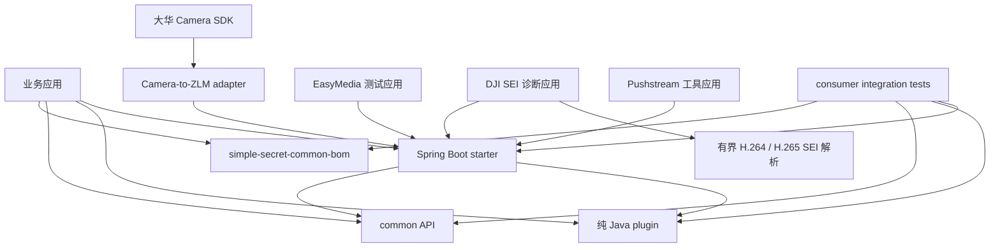
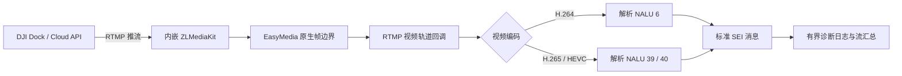

# Simple Secret

Simple Secret 是一组按需引入的 Java 17 插件和 Spring Boot 3.5 starter。项目遵循最小依赖原则：应用只需要引入实际使用的模块，不需要依赖整个项目。

## 模块说明

- `simple-secret-application`：应用聚合模块，包含 EasyMedia、DJI RTMP SEI 诊断和本地媒体推流工具。
- `simple-secret-common`：内部基础公共构件和对外 BOM。
- `simple-secret-common-toolbox`：零第三方运行时依赖的 Lambda 属性、URI、缓存、动态列和时间工具。
- `simple-secret-common-core`：零第三方依赖的 Result、异常、HTTP 状态码和校验分组。
- `simple-secret-common-dict`：只依赖 toolbox 的显式字典注册、枚举查询、TTL 缓存和对象字段翻译。
- `simple-secret-plugins`：纯 Java 插件聚合模块，当前包含 Geo Referencing、KMZ/KML、UDP 和 Excel。
- `simple-secret-plugin-geo`：零运行时依赖的像素坐标、WGS84 地理坐标和 DJI 照片/遥测投影。
- `simple-secret-plugin-kmz`：零运行时依赖的 KML、KMZ、DJI WPML 航点任务和 LineString 读取。
- `simple-secret-plugin-udp`：零运行时依赖的 UDP 单播、组播监听和生命周期管理。
- `simple-secret-plugin-excel`：基于 EasyExcel 的多 Sheet 导出、有界批量导入、错误工作簿、合并、下拉、列宽和树导出。
- `simple-secret-plugin-camera-sdk`：零生产依赖的摄像机厂商 SDK 领域模型、能力 SPI 和实例注册表。
- `simple-secret-plugin-camera-sdk-hikvision`：只依赖 Camera SDK API 与 JNA 的海康登录、PTZ、录像月历、实时预览和按时间回放驱动。
- `simple-secret-plugin-camera-sdk-dahua`：只依赖 Camera SDK API 与 JNA 的大华登录、PTZ、H.264 预览和热成像驱动。
- `simple-secret-springboot-starter-netty-websocket`：默认关闭的独立 Netty WebSocket 端口、多端点认证、文本处理和多连接推送。
- `simple-secret-springboot-starter-mqttv3`：MQTT 3.1.1 多客户端、发布订阅和请求响应。
- `simple-secret-springboot-starter-mqttv5`：MQTT v5 多客户端、发布订阅和请求响应。
- `simple-secret-springboot-starter-camera`：海康威视、大华摄像机和 NVR 的 RTSP 地址组装。
- `simple-secret-springboot-starter-nats`：NATS 多客户端、发布、请求响应和 queue group 订阅。
- `simple-secret-springboot-starter-influxdb`：InfluxDB 1.x 注解映射、安全 InfluxQL DSL、写入、查询和初始化。
- `simple-secret-springboot-starter-zlm4j`：嵌入式 ZLMediaKit、媒体代理、录像、RTP、截图和转码。
- `simple-secret-springboot-starter-easymedia`：基于 zlm4j 的 WebRTC 网关、媒体管理 API、H.264 裸流，并复用 UDP 插件提供组播能力。
- `simple-secret-springboot-starter-camera-zlm`：默认关闭的大华 H.264 Annex-B 到 EasyMedia/ZLM 独立适配层。
- `simple-secret-application-pushstream`：扫描受控本地目录，通过受管 FFmpeg 进程循环推送到内嵌 ZLMediaKit。
- `simple-secret-application-dji-sei-test`：接收 RTMP H.264/H.265 视频并输出标准 SEI 诊断与流汇总。

本项目不迁移 `auth`、`core` starter、`doc`、`encrypt`、`idempotent`、`json`、`magic-api`、
`mybatis-plus`、`redis`、`security`、`sensitive`、`tenant`、`web` 和 Servlet `websocket` starter。
需要这些能力时，应用应根据自身架构显式选择实现和依赖；`simple-secret-common-core` 等公共模块不受影响。

Honeybee 的 `dynamic-columns` 契约和通用内存缓存已经合并到 toolbox，不再建立只有接口或工具类的独立
starter。`cache-manager` 中绑定 MyBatis-Plus 的部分不迁移；`spring-extends` 依赖已禁止的 Commons
Configuration/BeanUtils 且只处理旧式 INI 装载，也不迁移。此取舍避免为了少量工具能力引入 Spring、
Hutool、MyBatis-Plus 或存在安全维护负担的传递依赖。

## 整体架构

Simple Secret 按“版本管理、公共能力、纯 Java 插件、Spring Boot 集成、示例应用”分层。业务模块不会依赖
示例应用，纯 Java 插件不会反向依赖 starter，starter 只组合自身必需的第三方库和少量明确声明的公共模块。



典型接入流程如下：

1. 应用导入 BOM，统一 Simple Secret 模块和关键第三方依赖版本。
2. 根据运行环境选择公共 API、纯 Java 插件或 Spring Boot starter，不引入聚合 POM 作为运行时依赖。
3. starter 读取 `simple-secret.*` 配置，校验开关、端点、容量和凭据后创建受管资源。
4. 业务代码通过公开接口调用能力，通过 handler、listener 或 SPI 接收异步事件。
5. 应用关闭时由 Spring 生命周期或模块的 `close`、`stop` API 释放线程、连接、套接字和原生资源。

## 文档索引

- [Common 聚合与依赖边界](simple-secret-common/README.md)
- [Common BOM](simple-secret-common/simple-secret-common-bom/README.md)
- [Common Core](simple-secret-common/simple-secret-common-core/README.md)
- [Common Toolbox](simple-secret-common/simple-secret-common-toolbox/README.md)
- [Common Dict](simple-secret-common/simple-secret-common-dict/README.md)
- [纯 Java Plugins](simple-secret-plugins/README.md)
- [Spring Boot Starters](simple-secret-springboot-starter/README.md)
- [示例应用](simple-secret-application/README.md)
- [第三方消费者集成测试](integration-tests/README.md)

## 接入准备

推荐先导入 BOM，再按需声明插件或 starter。以下教程均使用 `1.1.0`：

```xml
<repositories>
    <repository>
        <id>junpzx-custom-nexus</id>
        <url>https://repository.junpzx.cn/repository/maven-group/</url>
    </repository>
</repositories>

<dependencyManagement>
    <dependencies>
        <dependency>
            <groupId>com.ss</groupId>
            <artifactId>simple-secret-common-bom</artifactId>
            <version>1.1.0</version>
            <type>pom</type>
            <scope>import</scope>
        </dependency>
    </dependencies>
</dependencyManagement>
```

Simple Secret BOM 既管理保留模块版本，也锁定项目统一采用的 Jackson、Netty、POI、Commons 等第三方版本。若同一 `dependencyManagement` 同时导入 Simple Secret BOM 与 Spring Boot BOM，必须将 Simple Secret BOM 放在 Spring Boot BOM 前面，使这些约束优先生效。

所有模块的 Java 包统一使用 `com.ss.<模块缩写>.*`。自动配置均支持按模块关闭，不使用的模块不会主动启动外部连接或原生服务。

## Core API

只需要通用结果和异常类型时使用零第三方依赖模块：

```xml
<dependency>
    <groupId>com.ss</groupId>
    <artifactId>simple-secret-common-core</artifactId>
</dependency>
```

```java
import com.ss.core.domain.Result;
import com.ss.core.exception.BusinessException;

Result<String> token = Result.ok("token-value");
throw BusinessException.normalForModule(
        "orders", "order {} not found", orderId);
```

该模块仅提供通用模型，不注册 Spring Bean、不创建线程池，也不启动外部资源。

## Dict API

`simple-secret-common-dict` 是纯 Java 字典模块，生产依赖只有 toolbox：

```xml
<dependency>
    <groupId>com.ss</groupId>
    <artifactId>simple-secret-common-dict</artifactId>
</dependency>
```

```java
try (DictionaryRegistry registry = new DictionaryRegistry()) {
    registry.registerEnum("sex", Sex.class);
    registry.register("status", statusRepository::listDictValues);

    String label = registry.find("sex", "1").label();
    new DictionaryParser(registry).parse(userView);
}
```

模块不扫描 Spring、不按字符串加载类、不反射调用约定方法。数据源异常不会缓存，重复 key、错误注解
和不可写展示字段会明确失败。完整枚举、业务数据源、缓存失效、`DictService`、`@DictField` 和迁移案例见
[Dict README](simple-secret-common/simple-secret-common-dict/README.md)。

## Netty WebSocket Starter

`simple-secret-springboot-starter-netty-websocket` 提供不依赖 Servlet 容器的独立 Netty WebSocket 端口。
模块默认关闭；启用后默认只监听回环地址和随机端口，端点默认要求认证：

```xml
<dependency>
    <groupId>com.ss</groupId>
    <artifactId>simple-secret-springboot-starter-netty-websocket</artifactId>
</dependency>
```

```yaml
simple-secret:
  netty:
    websocket:
      enabled: true
      host: 127.0.0.1
      port: 9839
      endpoints:
        events:
          path: /events
          authentication-required: false
```

模块提供认证握手快照、文本 handler、同一身份多连接、按 path/session/身份推送和 Spring 托管生命周期，
不依赖 JSON、Servlet WebSocket、Redis、MQTT、Hutool 或 Lombok。完整认证、Origin、容量、JSON 按需组合、
手动启动和安全边界见
[Netty WebSocket Starter README](simple-secret-springboot-starter/simple-secret-springboot-starter-netty-websocket/README.md)。

## Geo Referencing Plugin

`simple-secret-plugin-geo` 提供通用像素/地理坐标转换、检测框批量定位、管线投影、DJI 照片 EXIF/XMP 读取和实时遥测投影。模块没有生产依赖，也不需要 Spring 容器：

```xml
<dependency>
    <groupId>com.ss</groupId>
    <artifactId>simple-secret-plugin-geo</artifactId>
</dependency>
```

```java
CameraState camera = new CameraState()
        .setLat(31.2304).setLon(121.4737).setAlt(120)
        .setGimbalYaw(30).setGimbalPitch(-90).setGimbalRoll(0)
        .setFovH(84).setFovV(53)
        .setFrameWidth(4000).setFrameHeight(3000);

GeoTarget target = GeoReferencer.pixelToGeo(
        new PixelCoordinate(2000, 1500), camera, 5.0);
```

完整的 DJI 照片、实时遥测、DEM 和管线投影案例见 [Geo Plugin README](simple-secret-plugins/simple-secret-plugin-geo/README.md)。

## KMZ/KML Plugin

`simple-secret-plugin-kmz` 提供 KML/WPML 航点任务读写、安全 KMZ 解压打包和普通 KML `LineString` 读取：

```xml
<dependency>
    <groupId>com.ss</groupId>
    <artifactId>simple-secret-plugin-kmz</artifactId>
</dependency>
```

```java
KmzMission mission = KmzMission.builder()
        .missionName("inspection")
        .waypoints(List.of(new Waypoint()
                .setIndex(0)
                .setCoordinate(new Coordinate(116.3975, 39.9087, 80))
                .setExecuteHeight(120)
                .setWaypointSpeed(8)))
        .build();

KmzWriter.write(mission, Path.of("inspection.kmz"));
KmzMission parsed = KmzParser.parse(Path.of("inspection.kmz"));
```

模块不会关闭调用方传入的流，并限制 XML、压缩输入、解压条目、航点和动作数量。完整的 DJI 文件选择规则、LineString 与 Geo 映射案例见 [KMZ Plugin README](simple-secret-plugins/simple-secret-plugin-kmz/README.md)。

## UDP Plugin

`simple-secret-plugin-udp` 是 JDK-only 的单播与组播监听插件：

```xml
<dependency>
    <groupId>com.ss</groupId>
    <artifactId>simple-secret-plugin-udp</artifactId>
</dependency>
```

```java
UdpUnicastManager manager = new UdpUnicastManager();
manager.startListener("0.0.0.0", 9000, packet -> {
    byte[] payload = java.util.Arrays.copyOfRange(
            packet.getData(), packet.getOffset(),
            packet.getOffset() + packet.getLength());
    consume(payload);
});

manager.stopListener("0.0.0.0", 9000);
```

插件只接受数值 IP，不执行 DNS 查询；监听线程异常退出时会从管理器自动移除。组播网卡选择、错误处理、消息长度和完整生命周期案例见 [UDP Plugin README](simple-secret-plugins/simple-secret-plugin-udp/README.md)。

## Excel Plugin

`simple-secret-plugin-excel` 是不依赖 Spring 或 Servlet 的流式 Excel 插件：

```xml
<dependency>
    <groupId>com.ss</groupId>
    <artifactId>simple-secret-plugin-excel</artifactId>
</dependency>
```

```java
ByteArrayOutputStream output = new ByteArrayOutputStream();
ExcelSheet<UserRow> sheet = ExcelSheet.<UserRow>builder()
        .name("users")
        .modelType(UserRow.class)
        .rows(users)
        .build();
new ExcelExporter().write(output, List.of(sheet));

ExcelImportRequest<UserRow> request = ExcelImportRequest.<UserRow>builder()
        .modelType(UserRow.class)
        .processor((rows, context) -> {
            repository.saveAll(rows);
            return Map.of();
        })
        .build();
ExcelImportResult<UserRow> result = new ExcelImporter().read(input, request);
```

插件不会关闭调用方流。默认按 500 行处理、最多读取 100000 行；完整的校验错误、合并单元格、下拉框、列宽和树导出案例见 [Excel Plugin README](simple-secret-plugins/simple-secret-plugin-excel/README.md)。

## MQTT v3 Starter

`simple-secret-springboot-starter-mqttv3` 基于 Eclipse Paho MQTT v3 客户端，提供 MQTT 3.1.1 多客户端、发布订阅、同步请求与重试、断线重连和 Spring Bean 自动订阅。模块直接依赖 Jackson 以支持消息上下文反序列化，不依赖 MQTT v5、Spring Cloud 或其他 Simple Secret starter：

```xml
<dependency>
    <groupId>com.ss</groupId>
    <artifactId>simple-secret-springboot-starter-mqttv3</artifactId>
</dependency>
```

只有显式启用的客户端会连接：

```yaml
simple-secret:
  mqttv3:
    enabled: true
    clients:
      default:
        enabled: true
        broker: tcp://localhost:1883
        client-id: simple-secret-v3-demo
        clean-session: true
        reconnect-enabled: true
```

声明处理器并发布消息：

```java
@Component
public class DeviceStateHandler implements MqttMessageHandler {
    @Override
    public String topic() {
        return "devices/+/state";
    }

    @Override
    public void handle(MqttMessageContext message) {
        DeviceState state = message.getPayload(DeviceState.class);
    }
}

mqttClientManager.publish(
        "default", "devices/device-01/commands", "{\"action\":\"status\"}", 1);
```

需要持久会话时必须使用稳定且唯一的 `client-id`，设置 `clean-session: false`，并确认 broker 的会话策略。共享订阅属于 broker 扩展，不是 MQTT 3.1.1 标准能力。v3 与 v5 starter 的配置前缀和 Bean 名相互隔离，可以在同一应用中共存。完整的多客户端、文件持久化、请求响应、非 Spring 和错误语义案例见 [MQTT v3 Starter README](simple-secret-springboot-starter/simple-secret-springboot-starter-mqttv3/README.md)。

## MQTT v5 Starter

### 功能和依赖边界

`simple-secret-springboot-starter-mqttv5` 提供多客户端连接、发布订阅、共享订阅、同步请求与重试、断线重连、Spring Bean 处理器发现和配置刷新。模块直接依赖 Jackson，消息上下文可以直接把 JSON payload 转为对象，不依赖其他 Simple Secret starter。

### Maven 依赖

```xml
<dependency>
    <groupId>com.ss</groupId>
    <artifactId>simple-secret-springboot-starter-mqttv5</artifactId>
</dependency>
```

### 最小配置

只有 `clients` 中显式设置 `enabled: true` 的客户端会建立连接。starter 不提供默认 broker、用户名或密码：

```yaml
simple-secret:
  mqtt:
    enabled: true
    clients:
      default:
        enabled: true
        broker: tcp://localhost:1883
        client-id: simple-secret-demo
        clean-start: true
        keep-alive-seconds: 30
        connection-timeout-seconds: 10
        publish-timeout-seconds: 10
        reconnect-enabled: true
        reconnect-delay-millis: 1000
```

生产环境建议通过密钥系统或环境变量注入账号密码。需要持久会话时应配置稳定且唯一的 `client-id`，并按 broker 语义设置 `clean-start: false`。

### 接收消息

将 `MqttMessageHandler` 实现声明为 Spring Bean，starter 会在客户端每次连接或重连成功后恢复订阅：

```java
import com.ss.mqttv5.handler.MqttMessageHandler;
import com.ss.mqttv5.message.MqttMessageContext;
import org.springframework.stereotype.Component;

@Component
public class DeviceStateHandler implements MqttMessageHandler {
    @Override
    public String topic() {
        return "devices/+/state";
    }

    @Override
    public int qos() {
        return 1;
    }

    @Override
    public void handle(MqttMessageContext message) {
        DeviceState state = message.getPayload(DeviceState.class);
        String actualTopic = message.getTopic();
        // 持久化状态；异常由业务侧自行记录或转换。
    }
}
```

处理器还可以通过 `clientKey()` 选择非默认客户端，通过 `shareGroup()` 创建 MQTT v5 共享订阅：

```java
@Component
public class SharedTelemetryHandler implements MqttMessageHandler {
    @Override
    public String clientKey() {
        return "telemetry";
    }

    @Override
    public String topic() {
        return "devices/+/telemetry";
    }

    @Override
    public String shareGroup() {
        return "telemetry-workers";
    }

    @Override
    public void handle(MqttMessageContext message) {
        String payload = message.getPayloadAsString();
    }
}
```

`MqttMessageContext` 是消息快照，支持 `getPayloadAsString()`、`getPayload(Class<T>)`、`getPayload(TypeReference<T>)`，并可读取实际 topic、订阅 filter、client key、QoS、retained 标记和 MQTT v5 properties。

### 发布消息

```java
import com.fasterxml.jackson.core.JsonProcessingException;
import com.fasterxml.jackson.databind.ObjectMapper;
import com.ss.mqttv5.client.MqttClientManager;
import org.springframework.stereotype.Service;

@Service
public class DeviceCommandPublisher {
    private final MqttClientManager mqtt;
    private final ObjectMapper objectMapper;

    public DeviceCommandPublisher(MqttClientManager mqtt, ObjectMapper objectMapper) {
        this.mqtt = mqtt;
        this.objectMapper = objectMapper;
    }

    public void reboot(String deviceId) throws JsonProcessingException {
        String payload = objectMapper.writeValueAsString(
                new DeviceCommand("reboot", System.currentTimeMillis()));
        mqtt.publish("default", "devices/" + deviceId + "/commands", payload, 1);
    }
}
```

发布前可使用 `mqtt.isConnected("default")` 判断连接状态。topic、filter、QoS 或连接状态不合法时会快速失败；发布异常统一包装为 `MqttOperationException`。

### 请求响应和重试案例

请求正文与响应正文必须能提取相同的关联键：

```java
import com.fasterxml.jackson.core.JsonProcessingException;
import com.fasterxml.jackson.databind.ObjectMapper;
import com.ss.mqttv5.message.MqttMessageContext;
import com.ss.mqttv5.waiter.MqttCorrelationExtractor;

import java.time.Duration;
import java.util.Optional;

String requestJson = "{\"requestId\":\"req-1001\",\"action\":\"status\"}";
ObjectMapper objectMapper = new ObjectMapper();
MqttCorrelationExtractor extractor = (type, payload) -> {
    try {
        return objectMapper.readTree(payload).path("requestId").asText();
    } catch (JsonProcessingException exception) {
        throw new IllegalArgumentException("invalid MQTT correlation payload", exception);
    }
};

Optional<MqttMessageContext> response = mqtt.requestWithRetry(
        "default",
        "devices/device-01/requests",
        "devices/device-01/replies",
        requestJson,
        1,
        Duration.ofSeconds(3),
        extractor,
        3);

DeviceReply reply = response
        .map(message -> message.getPayload(DeviceReply.class))
        .orElseThrow(() -> new IllegalStateException("MQTT request timed out"));
```

`attempts` 表示总发布次数而不是额外重试次数。同步等待会临时订阅 reply filter，并在完成、超时或异常后释放；业务关联键必须唯一，避免并发请求互相覆盖。

### 非 Spring 使用

```java
import com.ss.mqttv5.client.MqttClientManager;
import com.ss.mqttv5.config.MqttClientOptions;
import com.ss.mqttv5.waiter.DefaultMqttResponseWaiter;

import java.util.Map;
import java.util.concurrent.CountDownLatch;
import java.util.concurrent.ExecutorService;
import java.util.concurrent.Executors;
import java.util.concurrent.ScheduledExecutorService;
import java.util.concurrent.TimeUnit;

ExecutorService publisher = Executors.newFixedThreadPool(2);
ExecutorService handlers = Executors.newFixedThreadPool(4);
ScheduledExecutorService connections = Executors.newScheduledThreadPool(1);

MqttClientManager manager = new MqttClientManager(
        publisher, handlers, connections, new DefaultMqttResponseWaiter());
MqttClientOptions options = new MqttClientOptions();
options.setEnabled(true);
options.setBroker("tcp://localhost:1883");
options.setClientId("standalone-client");

CountDownLatch connected = new CountDownLatch(1);
manager.refreshClients(
        Map.of("default", options),
        (clientKey, current) -> connected.countDown());
if (!connected.await(10, TimeUnit.SECONDS)) {
    throw new IllegalStateException("MQTT connection timed out");
}
manager.publish("default", "demo/events", "{\"ok\":true}", 1);

manager.close();
publisher.shutdown();
handlers.shutdown();
connections.shutdown();
```

`MqttClientManager.close()` 只关闭 MQTT 客户端，不关闭调用方传入的线程池。自动配置创建的线程池由 Spring 负责销毁。

唯一配置前缀是 `simple-secret.mqtt`，设置 `simple-secret.mqtt.enabled=false` 可完全关闭自动配置。若运行环境存在 Spring Cloud，starter 会通过反射识别 `EnvironmentChangeEvent`，只有该前缀下的键发生变化时才刷新客户端，starter 本身不直接依赖 Spring Cloud。

## NATS Starter

`simple-secret-springboot-starter-nats` 提供 NATS 多客户端、发布、请求响应、普通订阅、queue group 和 Spring Bean 自动订阅。模块不依赖 JSON 实现，应用可自行选择 payload codec：

```xml
<dependency>
    <groupId>com.ss</groupId>
    <artifactId>simple-secret-springboot-starter-nats</artifactId>
</dependency>
```

只有显式启用的客户端会连接，starter 没有默认服务器或凭据：

```yaml
simple-secret:
  nats:
    clients:
      edge:
        enabled: true
        url: nats://localhost:4222
        connection-name: edge-service
```

声明消息处理器：

```java
@Component
public class DeviceStateHandler implements NatsMessageHandler {
    @Override
    public String clientKey() {
        return "edge";
    }

    @Override
    public String subject() {
        return "devices.*.state";
    }

    @Override
    public void handle(NatsMessageContext message) {
        String payload = message.getPayloadAsString();
    }
}
```

发布与请求响应：

```java
natsClientManager.publish("edge", "devices.a.commands", "restart");

Optional<NatsMessageContext> response = natsClientManager.request(
        "edge", "devices.a.status.request", new byte[0], Duration.ofSeconds(2));
```

`queue()` 默认为空，只有业务显式返回 queue group 才启用负载均衡。发布会等待 flush；请求超时返回空值；错误统一抛出 `NatsOperationException`，日志不输出 payload 或凭据。完整的校验器、JSON 解码、非 Spring 和安全案例见 [NATS Starter README](simple-secret-springboot-starter/simple-secret-springboot-starter-nats/README.md)。

## InfluxDB Starter

`simple-secret-springboot-starter-influxdb` 提供 InfluxDB 1.x 注解实体映射、单条和批量写入、安全 Lambda 查询、结果映射、分页、数据库与 retention policy 管理。默认关闭，不提供连接地址、凭据、数据库或自动初始化默认值：

```xml
<dependency>
    <groupId>com.ss</groupId>
    <artifactId>simple-secret-springboot-starter-influxdb</artifactId>
</dependency>
```

```yaml
simple-secret:
  influxdb:
    enabled: true
    url: http://localhost:8086
    database:
      name: metrics
    username: ${INFLUXDB_USERNAME:}
    password: ${INFLUXDB_PASSWORD:}
```

```java
@Measurement(name = "telemetry")
public class Telemetry {
    @Column(name = "device_id", tag = true)
    private String deviceId;

    @Column
    private Double value;

    public Telemetry() {
    }

    public Telemetry(String deviceId, Double value) {
        this.deviceId = deviceId;
        this.value = value;
    }

    public String getDeviceId() {
        return deviceId;
    }

    public Double getValue() {
        return value;
    }
}

operations.save(new Telemetry("device-a", 12.5));

List<Telemetry> records = operations.list(
        operations.wrapper(Telemetry.class)
                .eq(Telemetry::getDeviceId, "device-a")
                .ge(Telemetry::getValue, 10)
                .orderByTimeDesc()
                .limit(100));
```

DSL 对 identifier、函数、duration、数值类型和字符串字面量统一校验与转义，不提供任意原始条件片段。分页计数必须选择非 tag、非 time 的普通 field，并且分页查询不能包含分组。原始 InfluxQL API 只适合可信代码，禁止拼接请求参数。完整的实体、分页、Service、自动初始化、非 Spring 和安全案例见 [InfluxDB Starter README](simple-secret-springboot-starter/simple-secret-springboot-starter-influxdb/README.md)。

## Camera SDK Plugin

`simple-secret-plugin-camera-sdk` 是摄像机厂商 SDK 的 JDK-only API/SPI 层，提供登录、PTZ、实时预览、历史回放查询所需的领域对象和服务接口。它不包含海康/大华 JNA 绑定，不加载原生库，不依赖 Spring、JSON、ZLM4J、Hutool 或 Lombok：

```xml
<dependency>
    <groupId>com.ss</groupId>
    <artifactId>simple-secret-plugin-camera-sdk</artifactId>
</dependency>
```

第三方驱动实现 `PtzControlService`、`PlayService`、`DeviceLoginService` 或 `PlayQueryService` 后，可由调用方显式建立不可变注册表：

```java
CameraSdkServiceRegistry registry = new CameraSdkServiceRegistry(
        List.of(vendorLoginService, vendorPtzService, vendorPlayQueryService));

PTZControlDomain control = new PTZControlDomain()
        .setCommand(PtzControlCommandEnums.LEFT)
        .setSpeedLevel(5)
        .setIsBegin(true);
registry.requirePtz("Hikvision").syncControl(device, control);
List<PlaybackTimePeriodDomain> month = registry.requirePlayQuery("Hikvision")
        .playbackRecordExistByMonth(device, request, 2026, 8);
```

模块不会扫描 SPI 文件或读取 Spring 全局 Bean；厂商 native 路径、登录缓存、生命周期和 ZLM 推流适配由后续按需模块负责。完整领域对象、服务实现和迁移边界见 [Camera SDK Plugin README](simple-secret-plugins/simple-secret-plugin-camera-sdk/README.md)。

海康 HCNetSDK 用户可额外按需引入：

```xml
<dependency>
    <groupId>com.ss</groupId>
    <artifactId>simple-secret-plugin-camera-sdk-hikvision</artifactId>
</dependency>
```

该驱动仅增加 JNA 依赖，不携带厂商原生库，不依赖 Spring、JSON、ZLM、FFmpeg 或 PlayCtrl；支持显式生命周期、登录、同步/有界异步 PTZ、录像月历查询、实时预览和按时间历史回放。取流流程为“设备登录 -> HCNetSDK 预览或回放 -> 原生数据复制 -> 业务 handler -> 会话关闭”，返回的是 HCNetSDK 原始数据而不是已解码视频帧。完整原生库布局、调用案例、线程约束和安全边界见 [Hikvision Camera SDK Plugin README](simple-secret-plugins/simple-secret-plugin-camera-sdk-hikvision/README.md)。

大华 NetSDK 用户可额外按需引入：

```xml
<dependency>
    <groupId>com.ss</groupId>
    <artifactId>simple-secret-plugin-camera-sdk-dahua</artifactId>
</dependency>
```

该驱动只增加 JNA，不携带任何厂商 native 二进制，也不依赖 Spring、JSON、ZLM 或 Flink CDC。它提供显式 `open`/`close`、登录/注销、同步/有界异步 PTZ、Annex-B H.264 预览，以及热成像订阅、抓取、测温与历史查询；仅支持 Windows 和 Linux，macOS 会明确拒绝。原生库目录、完整示例和资源关闭要求见 [Dahua Camera SDK Plugin README](simple-secret-plugins/simple-secret-plugin-camera-sdk-dahua/README.md)。

两个厂商驱动均将稳定服务入口、配置、异常、会话和用户可见结果保留在
`com.ss.ics.dahua`、`com.ss.ics.hikvision` 根包，将原生适配接口、native 快照、查询流程和
JNA 加载实现放入 `internal.*` 子包。第三方应用不应依赖 `internal.*`；根包中的
`DahuaJnaStructures`、`HikvisionJnaStructures` 仅为保持已有完整类名兼容而保留；
大华结构公开字段引用的 `DahuaNativeLibrary` 回调类型也保留在根包，但实际厂商函数绑定位于内部包。

### Camera SDK 转推 ZLM

需要把大华实时 H.264 转推 ZLM 时，额外按需引入独立适配 starter：

```xml
<dependency>
    <groupId>com.ss</groupId>
    <artifactId>simple-secret-springboot-starter-camera-zlm</artifactId>
</dependency>
```

该模块默认关闭，且要求宿主显式提供 `DahuaCameraSdkService` Bean。启用
`simple-secret.camera-zlm.enabled=true` 后，通过 `DahuaZlmStreamService.start(device, play, app, stream)`
创建可关闭会话。每路流使用有界队列和单线程顺序消费；队列溢出或 publisher 失败会自动停止设备预览
和 ZLM 流，并在 `session.failure()` 中保留异常。

海康原始回调可能是系统头或 PS 流，不能直接作为 Annex-B H.264 推送，因此本阶段只支持大华。
模块架构、Bean 创建、完整代码案例、关闭顺序和真实环境联调要求见
[Camera-to-ZLM Starter README](simple-secret-springboot-starter/simple-secret-springboot-starter-camera-zlm/README.md)。

## Camera Starter

`simple-secret-springboot-starter-camera` 提供海康威视和大华摄像机/NVR 的 RTSP 地址组装。它不依赖厂商 SDK、JNA、ZLM4J、Hutool、Lombok 或 JSON 模块，也不会连接设备或启动原生服务。

自动配置默认启用；设置 `simple-secret.camera.enabled=false` 可完全关闭内置组装器和 `UrlAssemblyHolder`。

```xml
<dependency>
    <groupId>com.ss</groupId>
    <artifactId>simple-secret-springboot-starter-camera</artifactId>
</dependency>
```

Spring Boot 会自动提供 `UrlAssemblyHolder`。业务代码传入品牌、设备类型、账号、密码、主机、端口、通道和码流类型即可生成地址；账号与密码会按 URI user-info 规则进行百分号编码：

```java
StreamUrlAssemblyDomain request = new StreamUrlAssemblyDomain()
        .setBrand(CameraBrandEnums.HIKVISION.getCode())
        .setType(CameraTypeEnums.NVR.getCode())
        .setIp("192.0.2.10")
        .setPort("554")
        .setAccount("admin")
        .setPassword(System.getenv("CAMERA_PASSWORD"))
        .setChannelNo("1")
        .setStreamType("main");

String rtspUrl = urlAssemblyHolder.assembly(request);
```

生成的 RTSP URL 包含凭据，不要写入日志、异常详情、监控标签或接口响应。完整的四种设备案例、自定义厂商扩展、参数约束和非 Spring 用法见 [Camera Starter README](simple-secret-springboot-starter/simple-secret-springboot-starter-camera/README.md)。

## ZLM4J Starter

### 功能和运行边界

`simple-secret-springboot-starter-zlm4j` 通过 `com.aizuda:zlm4j` 的 JNA 绑定在当前 JVM 中运行 ZLMediaKit，提供推拉流代理、流查询、MP4/TS 录像、RTP 服务、统计、服务器配置、FFmpeg 转码和截图。该 starter 面向 Spring Boot 使用，只有显式开启时才初始化原生媒体服务。

### Maven 依赖

```xml
<dependency>
    <groupId>com.ss</groupId>
    <artifactId>simple-secret-springboot-starter-zlm4j</artifactId>
</dependency>
```

### 最小配置

ZLM 默认关闭，匿名播放和匿名推流默认拒绝：

```yaml
simple-secret:
  zlm4j:
    enabled: true
    listen-ip: 127.0.0.1
    allow-anonymous-play: false
    allow-anonymous-publish: false
    root-path: ./www
    thread-num: 5
    rtmp-port: 7935
    rtsp-port: 7554
    http-port: 7080
    rtc-port: 8000
    http-listener-enabled: true
    rtsp-listener-enabled: true
    rtmp-listener-enabled: true
    rtc-listener-enabled: true
```

ZLM 启动时以原生 `mk_ini_default()` 为基础，再应用 `ZlmMediaProperties` 明确暴露的配置字段。starter 内置的
`simple-secret__zlm4j-default__conf.ini` 用于内部默认配置加载，不是任意 INI 键的透传入口；第三方应用应只
使用配置元数据中存在的 `simple-secret.zlm4j.*` 属性。四个 `*-listener-enabled` 开关控制原生 HTTP、RTSP、
RTMP 和 RTC socket listener，默认全部启用且至少必须启用一个；`enable-rtmp`、`enable-rtsp` 等属性只控制
协议 mux/output，不控制端口监听。启用前应确认实际启用的端口未被占用，并由部署环境提供与操作系统、CPU
架构匹配的 ZLMediaKit 原生库 `mk_api`。

流注册、无读者和查询路径通过共享 Assembler 将媒体源转为 Java 快照。其流程为“读取媒体源标识和统计 ->
逐轨读取复制引用 -> 复制轨道元数据 -> 在 `finally` 中释放有效引用 -> 发布或返回 Java 对象”。空轨道被
跳过，单轨元数据读取或释放异常只记录有界 WARN 并继续处理后续轨道。共享 Assembler 不把 `MK_TRACK`
所有权传给业务代码；需要原生帧 delegate 的 EasyMedia 使用独立的注册生命周期持有引用，直至精确注销。

截图、转码和视频拼接还依赖 JavaCPP FFmpeg native。starter 项目中的 Maven OS profile 只在构建 starter 源码时生效，不会传递给消费项目，因此宿主必须按部署平台显式增加 runtime classifier。Linux x86-64 示例：

```xml
<dependencies>
    <dependency>
        <groupId>org.bytedeco</groupId>
        <artifactId>javacpp</artifactId>
        <version>1.5.10</version>
        <classifier>linux-x86_64</classifier>
        <scope>runtime</scope>
    </dependency>
    <dependency>
        <groupId>org.bytedeco</groupId>
        <artifactId>ffmpeg</artifactId>
        <version>6.1.1-1.5.10</version>
        <classifier>linux-x86_64-gpl</classifier>
        <scope>runtime</scope>
    </dependency>
</dependencies>
```

其他受支持 classifier 为 `linux-arm64`、`windows-x86_64`、`macosx-arm64`、`macosx-x86_64`，FFmpeg classifier 均需追加 `-gpl`。只使用不经过 FFmpeg 的媒体服务接口时无需额外引入这些 classifier，但 `mk_api` 仍必须由部署环境提供。

### 拉流代理和在线状态案例

自动配置会提供 `IZlmMediaService`：

```java
import com.ss.zlm4j.service.IZlmMediaService;
import com.ss.zlm4j.service.domain.bo.MediaQueryBO;
import com.ss.zlm4j.service.domain.bo.StreamProxyPullerBO;
import org.springframework.stereotype.Service;

@Service
public class CameraStreamService {
    private final IZlmMediaService mediaService;

    public CameraStreamService(IZlmMediaService mediaService) {
        this.mediaService = mediaService;
    }

    public String startCamera(String rtspUrl) {
        StreamProxyPullerBO request = new StreamProxyPullerBO()
                .setApp("live")
                .setStream("camera-01")
                .setUrl(rtspUrl)
                .setRetryCount(-1)
                .setRtpType(0);
        return mediaService.addStreamPullerProxy(request);
    }

    public boolean isOnline() {
        MediaQueryBO query = new MediaQueryBO()
                .setApp("live")
                .setStream("camera-01")
                .setSchema("rtsp");
        return Boolean.TRUE.equals(mediaService.isMediaOnline(query));
    }

    public void stopCamera(String proxyKey) {
        mediaService.delStreamPullerProxy(proxyKey);
    }
}
```

`addStreamPullerProxy` 和 `addStreamPusherProxy` 只有在 native 首次连接成功后才返回代理 key，业务侧应保存
该 key 以便精确删除代理。首次连接失败、等待超过 5 秒或等待线程被中断时会抛出
`ZlmOperationException`，并移除回调、注册信息和释放 native 资源，不会把错误文本或 `null` 当作成功结果。
同一 key 被重新注册后，旧代理的延迟关闭回调不会清理新代理的回调。
服务开始关闭后会永久拒绝创建新的推流、拉流和 RTP 资源。关闭时会尝试释放全部已注册资源；某个 native
资源释放失败不会阻止其他资源清理，失败资源会保留在注册表中，调用方可再次执行 `close()` 重试。

不要把不可信客户端提交的 URL 直接传入服务，仍应在业务层校验租户、设备归属和允许的媒体源。

### 录像、RTP、截图和转码

```java
import com.ss.zlm4j.service.ISnapService;
import com.ss.zlm4j.service.ITranscodeService;
import com.ss.zlm4j.service.IZlmMediaService;
import com.ss.zlm4j.service.domain.bo.OpenRtpServerBO;
import com.ss.zlm4j.service.domain.bo.StartRecordBO;
import com.ss.zlm4j.service.domain.bo.TranscodeBO;

StartRecordBO record = new StartRecordBO()
        .setApp("live")
        .setStream("camera-01")
        .setType(1)
        .setCustomizedPath("records/camera-01")
        .setMaxSecond(300L);
boolean recording = Boolean.TRUE.equals(mediaService.startRecord(record));

int rtpPort = mediaService.openRtpServer(new OpenRtpServerBO()
        .setPort(0)
        .setTcpMode(0)
        .setStream("rtp-camera-01"));

String jpegBase64 = snapService.snapToBase64(
        "https://media.example/live/camera-01.live.ts");

transcodeService.transcode(new TranscodeBO()
        .setUrl("rtsp://camera.example/live")
        .setApp("transcoded")
        .setStream("camera-01")
        .setEnableAudio(true)
        .setScaleWidth(1280)
        .setScaleHeight(720));
```

上例中的 `mediaService`、`snapService`、`transcodeService` 分别为注入的 `IZlmMediaService`、`ISnapService`、`ITranscodeService`。业务停止时应对应调用 `stopRecord`、`closeRtpServer` 或 `stopTranscode` 释放资源。

### 监听 ZLM 事件

ZLM hook 会转换为 Spring 事件，可以按业务需要监听：

```java
import com.ss.zlm4j.event.StreamRegisteredEvent;
import org.springframework.context.event.EventListener;
import org.springframework.stereotype.Component;

@Component
public class StreamEventListener {
    @EventListener
    public void onStreamRegistered(StreamRegisteredEvent event) {
        String stream = event.getMediaSource().getStream();
        // 更新业务流状态。
    }
}
```

需要替换特定 hook 行为时，可注册 `ZlmCallbackHandlerRegister`，不要直接修改 starter 内部上下文。

### 资源访问和部署安全

所有外部媒体 URL 都会经过 `simple-secret.zlm4j.resource-policy` 校验。默认允许常用媒体协议，但拒绝 URL user-info、回环、私网、链路本地、多播、CGNAT 和 IPv6 ULA 地址。确需访问内网媒体源时，只开放明确主机或最小 CIDR：

```yaml
simple-secret:
  zlm4j:
    mp4-save-path: /srv/simple-secret/recordings/mp4
    hls-save-path: /srv/simple-secret/recordings/hls
    resource-policy:
      allowed-hosts:
        - camera.internal.example
      allowed-cidrs:
        - 10.20.30.0/24
      recording-root: /srv/simple-secret/recordings
```

`StartRecordBO.customizedPath` 非空时只能写入 `recording-root` 下；为空时 ZLM 使用 `mp4-save-path` 或 `hls-save-path`，这两个全局保存路径不会再经过 `recording-root` 校验，生产配置也必须把它们限制在专用媒体目录。生产环境还应在网络层限制 RTSP、RTMP、HTTP 和 RTC 端口，并在业务层实现播放、推流鉴权。

FFmpeg 使用 `*-gpl` classifier，发布或分发应用前必须自行确认 GPL 许可义务。

## EasyMedia Starter

### 功能和依赖边界

`simple-secret-springboot-starter-easymedia` 建立在 zlm4j starter 之上，提供 WHIP/WHEP WebRTC 网关、会话仓储、鉴权限流、失败关闭补偿、通用媒体管理 API、H.264 裸流推送和 UDP 组播监听。

该 starter 只在以下条件同时满足时加载：

- `simple-secret.zlm4j.enabled=true`。
- `simple-secret.easymedia.enabled=true`。
- classpath 存在 Servlet、Jakarta Validation 和 Spring Web MVC。

### Maven 依赖

EasyMedia 会传递依赖 zlm4j。宿主 Web 应用还需要显式提供 Web MVC 和 Validation：

```xml
<dependencies>
    <dependency>
        <groupId>com.ss</groupId>
        <artifactId>simple-secret-springboot-starter-easymedia</artifactId>
    </dependency>
    <dependency>
        <groupId>org.springframework.boot</groupId>
        <artifactId>spring-boot-starter-web</artifactId>
    </dependency>
    <dependency>
        <groupId>org.springframework.boot</groupId>
        <artifactId>spring-boot-starter-validation</artifactId>
    </dependency>
</dependencies>
```

### 最小安全配置

```yaml
simple-secret:
  zlm4j:
    enabled: true
  easymedia:
    enabled: true
    management-api-enabled: false
    webrtc:
      enabled: true
      local-zlm-enabled: true
      max-sdp-bytes: 65536
      security:
        authentication-required: true
      rate-limit:
        enabled: true
        publish-per-minute: 60
        play-per-minute: 120
        session-operation-per-minute: 300
```

推荐的内嵌模式使用 `local-zlm-enabled=true`，网关直接调用当前 JVM 的 ZLM C API，不需要放宽 ZLM 的匿名播放和推流 hook。该模式只完成 SDP Offer/Answer，不提供可 PATCH/DELETE 的上游会话资源。当前内嵌 ZLMediaKit 不支持 Trickle ICE PATCH，因此 `trickle-ice-enabled` 默认关闭。

### WHIP 推流和 WHEP 播放

以下请求假定宿主应用已经按“接入宿主认证和授权”一节提供身份解析，并能从 Bearer Token 建立当前用户上下文。保持默认安全配置但未提供 `WebRtcIdentityProvider` 时，请求会返回 `401`。

创建 WHIP 会话：

```bash
curl -i \
  -X POST \
  -H 'Authorization: Bearer <access-token>' \
  -H 'Content-Type: application/sdp' \
  --data-binary @offer.sdp \
  'http://localhost:8080/easyMedia/api/webrtc/whip?app=live&stream=camera-01'
```

创建 WHEP 会话：

```bash
curl -i \
  -X POST \
  -H 'Authorization: Bearer <access-token>' \
  -H 'Content-Type: application/sdp' \
  --data-binary @offer.sdp \
  'http://localhost:8080/easyMedia/api/webrtc/whep?app=live&stream=camera-01'
```

响应 body 是 `application/sdp` 的 SDP Answer。推荐的本地 C API 模式不会返回可管理的 `Location`，媒体连接由 WebRTC 客户端自身结束。

如果确实需要 `Location`、PATCH、DELETE 和失败关闭补偿，可改用受管 HTTP 信令模式：

```yaml
simple-secret:
  zlm4j:
    enabled: true
    listen-ip: 127.0.0.1
    allow-anonymous-play: true
    allow-anonymous-publish: true
  easymedia:
    enabled: true
    webrtc:
      local-zlm-enabled: false
      signaling-base-url: http://127.0.0.1:7080
```

HTTP 转发器不会把外部 Bearer Token 或 `WebRtcIdentity` 传给上游 ZLM，因此上例必须允许上游匿名 hook。该配置只适用于 ZLM 全部媒体端口均绑定回环地址或处于严格隔离的可信内部网络；不得在放宽匿名 hook 后把 ZLM RTSP、RTMP、HTTP、RTC 端口直接暴露到公网。公网用户仍必须先通过 EasyMedia 网关的宿主认证和授权。

受管 HTTP 模式会通过 `Location` 返回会话资源，关闭时使用该地址：

```bash
curl -i -X DELETE \
  -H 'Authorization: Bearer <access-token>' \
  'http://localhost:8080/easyMedia/api/webrtc/sessions/{sessionId}'
```

上游明确支持 Trickle ICE 且配置 `trickle-ice-enabled=true` 后，受管 HTTP 模式才可以发送：

```bash
curl -i \
  -X PATCH \
  -H 'Authorization: Bearer <access-token>' \
  -H 'Content-Type: application/trickle-ice-sdpfrag' \
  --data-binary @candidate.sdpfrag \
  'http://localhost:8080/easyMedia/api/webrtc/sessions/{sessionId}'
```

### 接入宿主认证和授权

默认 `authentication-required=true` 且没有固定 `default-subject`，匿名请求会被拒绝。生产环境应提供自己的 `WebRtcIdentityProvider`，并按需替换 `WebRtcAccessPolicy`：

```java
import com.ss.easymedia.webrtc.domain.WebRtcIdentity;
import com.ss.easymedia.webrtc.security.WebRtcIdentityProvider;
import org.springframework.context.annotation.Bean;
import org.springframework.context.annotation.Configuration;

@Configuration
class WebRtcSecurityConfiguration {
    @Bean
    WebRtcIdentityProvider webRtcIdentityProvider(CurrentUserService currentUser) {
        return clientIp -> {
            CurrentUser user = currentUser.requiredUser();
            return new WebRtcIdentity(
                    user.tenantId(), user.userId(), true);
        };
    }
}
```

默认访问策略会校验认证状态和会话所有权。多租户应用如果允许管理员跨主体操作会话，应实现 `WebRtcAccessPolicy`，同时保留租户隔离和显式权限判断。

### 开启媒体管理 API

`/easyMedia/api/common/*` 默认不暴露。即使配置 `management-api-enabled=true`，starter 也会默认拒绝全部管理请求；宿主必须提供授权 Bean：

```java
import com.ss.easymedia.security.EasyMediaManagementAuthorizer;
import org.springframework.context.annotation.Bean;

@Bean
EasyMediaManagementAuthorizer easyMediaManagementAuthorizer() {
    return request -> request.isUserInRole("MEDIA_ADMIN");
}
```

授权器只保护通用管理路径，不能替代 WebRTC 的 `WebRtcIdentityProvider` 和 `WebRtcAccessPolicy`。不需要 HTTP 管理能力时应保持 `management-api-enabled=false`，直接注入 zlm4j 服务接口完成业务操作。

### H.264 裸流推送

`H264NakedFlowPushZlmManager` 不是默认 Bean。需要时由宿主显式声明，以保持非必要能力不初始化：

```java
import com.ss.easymedia.h264.H264NakedFlowPushZlmManager;
import com.ss.zlm4j.config.properties.ZlmMediaProperties;
import org.springframework.context.annotation.Bean;

@Bean(destroyMethod = "close")
H264NakedFlowPushZlmManager h264PushManager(
        ZlmMediaProperties properties) {
    return new H264NakedFlowPushZlmManager(properties);
}
```

业务侧按 H.264 Annex-B 数据到达顺序推送，并在结束时释放单路流：

```java
h264PushManager.push("live", "camera-01", h264Bytes);
h264PushManager.stopPush("live", "camera-01");
```

默认处理队列容量为 150。使用三参数构造器时，`processQueueSize` 必须大于 0，不再支持无界队列。队列已满时，`push` 会阻塞形成背压；等待期间线程被中断会抛出 `InterruptedException`，对应流被停止时会快速抛出 `IllegalStateException`，不会永久阻塞在已无人消费的队列上。

读取器按连续字节流识别三字节和四字节 Annex-B 起始码，支持跨输入片段的起始码和单片段内多个 NALU。
同步 `pushWithBackpressure` 会把解析器异常、ZLM native frame 创建失败和输入失败传播给调用方；
Camera-to-ZLM 收到这些失败后会停止对应设备预览和 ZLM 流，并在 `session.failure()` 中保留异常。

单个尚未完成重组的 NALU 最多累积 16 MiB。超过上限时读取器会丢弃该不完整 NALU、记录异常并继续处理后续片段，避免异常输入持续占用堆内存。长时间没有数据的流会自动回收；应用关闭时 Spring 会调用 `close()` 释放全部原生资源。

### UDP 组播

启用 EasyMedia 后会自动提供 `UdpMulticastManager`：

```java
import com.ss.easymedia.support.udp.UdpMulticastManager;

udpMulticastManager.joinGroup(
        "239.10.10.10",
        5000,
        "192.168.1.20",
        packet -> process(packet.getData(), packet.getOffset(), packet.getLength()));

udpMulticastManager.leaveGroup(
        "239.10.10.10", 5000, "192.168.1.20");
```

`groupIp` 和 `localIp` 必须使用数字 IP，且地址族一致；`groupIp` 必须是组播地址，端口范围为 1 到 65535，`localIp` 必须绑定在部署主机的单播网卡上，handler 不能为空。`setMaxMessageLength` 只允许在线程启动前调用，报文长度范围为 1 到 65507 字节。重复加入相同的本地 IP、组播地址和端口不会创建第二个监听器；Spring 容器关闭时会停止全部监听器。

### 单机和多实例部署

Redisson 是 optional 依赖。classpath 中存在 `RedissonClient` Bean 时，WebRTC 自动使用 Redis 会话仓储和分布式限流；否则使用单机内存仓储和有界本地限流。多实例生产部署应由宿主显式引入并配置 Redisson，所有实例还应使用相同的会话 TTL、限流配置和 ZLM 路由策略。

WebRTC 入口应置于 HTTPS 反向代理之后，并由代理限制请求体、连接数和可信转发头。不要在公网直接暴露 ZLM 原生管理端口或 EasyMedia 通用管理接口。

### 可运行测试应用

[`simple-secret-application-easymedia-test`](simple-secret-application/simple-secret-application-easymedia-test/README.md) 提供了一个参考 Honeybee application 组织方式的最小 Spring Boot 测试程序。它直接复用 EasyMedia starter 的 WebRTC 和媒体管理控制器，默认绑定 `127.0.0.1:9878`，并通过 `local` profile 启用内嵌 ZLM。

构建并启动：

```bash
JAVA_HOME=/opt/homebrew/opt/openjdk@17 \
mvn -pl simple-secret-application/simple-secret-application-easymedia-test \
    -am package

JAVA_HOME=/opt/homebrew/opt/openjdk@17 \
DYLD_LIBRARY_PATH=/path/to/zlmediakit/lib \
java -Djna.library.path=/path/to/zlmediakit/lib \
  -jar simple-secret-application/simple-secret-application-easymedia-test/target/simple-secret-application-easymedia-test.jar \
  --spring.profiles.active=local
```

运行环境必须提供与当前平台匹配的 ZLMediaKit `mk_api` 动态库。`jna.library.path` 负责定位直接加载的 `mk_api`，其传递动态库依赖仍由系统链接器通过 macOS `DYLD_LIBRARY_PATH`、Linux `LD_LIBRARY_PATH`、Windows `PATH`、rpath 或系统安装目录解析。完整的管理令牌、WHIP/WHEP 请求和真实合约测试示例见该模块 README。

### DJI RTMP SEI 测试应用

[`simple-secret-application-dji-sei-test`](simple-secret-application/simple-secret-application-dji-sei-test/README.md)
是独立可运行的 Spring Boot 诊断应用，用于验证 DJI Dock 或
DJI Cloud API 提供的 RTMP 视频流中是否实际包含 SEI 数据。该应用只验证视频码流中的标准 SEI，不接入
MQTT、不保存业务数据，也不推测未公开的 DJI 姿态载荷格式。

应用复用 EasyMedia starter 和内嵌 ZLMediaKit。DJI 设备向
`rtmp://<host>:7935/live/<streamId>` 推流后，ZLMediaKit 注册媒体源，应用通过
`TrackDelegateCallback` 获取 RTMP 视频轨道编码帧，并按轨道编码类型交给纯 Java SEI 解析器：



解析器同时支持三字节和四字节 Annex-B 起始码，移除 emulation-prevention 字节，并按 H.26x 规范读取变长
`payloadType` 与 `payloadSize`。对于 `user_data_unregistered`，日志额外显示 UUID；其他 payload 保留原始
字节，只输出受限的十六进制和可打印 UTF-8 预览。
EasyMedia 在读取原生指针前校验帧大小与指针，再分配 Java 数组。
大小、空指针或空轨道被桥接层拒绝时，只记录不含 payload 的有界 WARN；该帧不会进入
`DjiSeiTrackCallback`，也不计入 `videoFrames` 或 `malformedMessages`。
桥接层按原生媒体源指针维护精确注册生命周期：同指针重复注册不重复通知或安装 delegate；每个有效的
复制 `MK_TRACK` 引用在读取元数据前被生命周期接管，并在精确注销时逐一执行一次 `mk_track_unref`。
`mk_track_add_delegate` 的 void 调用即使抛出异常也可能已经在原生侧生效，因此异常会继续抛出，轨道和回调
所有权仍保留到精确注销；重复注销不会再次释放。
注册与注销控制事件按处理器串行化，注销不会错过尚未完成的生命周期插入和轨道接管。
解析器限制单帧、payload、SEI NAL、消息和问题数量。诊断回调还限制日志和预览长度。
进入解析器后的语法错误、消息/NAL 数量超限和 payload 超限只计入当前流 `malformedMessages`，
不得中断媒体回调线程。

应用在媒体源注册时记录 `app`、`streamId`、编码和轨道信息；检测到 SEI 时记录 PTS、DTS、payload type、
长度、UUID 和受限预览。没有 SEI 的视频帧不逐帧打印，而是按配置周期输出累计帧数和 `seiCount=0`。
媒体源注销时输出视频帧数、SEI NALU 数、SEI 消息数、畸形消息数和运行时长，确保能够区分“流中没有
SEI”和“存在 SEI 但解析失败”。

默认配置关闭 zlm4j 和 EasyMedia，普通单元测试及 Spring 上下文测试不依赖原生库；`local` profile 才启用
内嵌媒体服务。自动化测试覆盖 H.264/H.265、三/四字节起始码、多消息、转义字节、UUID、截断和超限输入。
构建并启动：

```bash
JAVA_HOME=/opt/homebrew/opt/openjdk@17 mvn -pl \
  simple-secret-application/simple-secret-application-dji-sei-test -am package

JAVA_HOME=/opt/homebrew/opt/openjdk@17 \
DYLD_LIBRARY_PATH=/path/to/zlmediakit/lib \
java -Djna.library.path=/path/to/zlmediakit/lib \
  -jar simple-secret-application/simple-secret-application-dji-sei-test/target/\
simple-secret-application-dji-sei-test.jar --spring.profiles.active=local
```

运行环境必须提供兼容的 ZLMediaKit `mk_api`。`jna.library.path` 定位 `mk_api`，其传递依赖由 macOS
`DYLD_LIBRARY_PATH`、Linux `LD_LIBRARY_PATH`、Windows `PATH`、rpath 或系统安装目录解析。推流地址为
`rtmp://<host>:7935/live/<streamId>`。配置可通过 `SIMPLE_SECRET_DJI_SEI_APP`、
`SIMPLE_SECRET_DJI_SEI_MAX_FRAME_BYTES`、`SIMPLE_SECRET_DJI_SEI_MAX_PAYLOAD_BYTES`、
`SIMPLE_SECRET_DJI_SEI_PREVIEW_BYTES`、`SIMPLE_SECRET_DJI_SEI_MAX_NAL_UNITS`、
`SIMPLE_SECRET_DJI_SEI_MAX_MESSAGES`、`SIMPLE_SECRET_DJI_SEI_MAX_ISSUES`、
`SIMPLE_SECRET_DJI_SEI_MAX_MESSAGE_LOGS`、`SIMPLE_SECRET_DJI_SEI_SUMMARY_INTERVAL`、
`SIMPLE_SECRET_DJI_SEI_RTMP_PORT` 和 `SIMPLE_SECRET_DJI_SEI_ROOT` 调整。

该应用的 `local` profile 只启用原生 RTMP listener，不启动 ZLMediaKit HTTP、RTSP 或 RTC listener，因此除
RTMP 端口外不需要预留 7080、7554 或 8000 端口。

`DJI RTMP SEI detected` 表示解析到标准 SEI；`videoFrames` 为正且 `seiMessages=0` 表示收到视频但未发现
支持的 SEI；`malformedMessages` 为正表示已进入解析器的 SEI-like 数据违反语法、数量或 payload 约束。
EasyMedia 桥接层拒绝的帧不进入上述两项统计。先停止推流可触发媒体注销和
最终 `DJI RTMP stream summary`，随后可用 `Ctrl+C` 关闭应用和内嵌 ZLMediaKit。

自动化验证只证明解析器和 Spring 装配；当前没有提供真实 DJI 流或原生 `mk_api`，未宣称完成真实 DJI 验证。
Cloud API 的遥测、姿态、云台或定位字段不会从 RTMP 推断，除非其 SEI payload schema 已被独立公开并确认。
完整配置、示例日志、安全边界和关闭说明见该应用 README。

## Pushstream Application

[`simple-secret-application-pushstream`](simple-secret-application/simple-secret-application-pushstream/README.md)
迁移了 Honeybee 的本地文件自动推流能力。新实现使用纯 JDK 文件扫描、实例级快照、单线程调度和
`ProcessBuilder(List<String>)`，不再生成 Shell 脚本，也不使用静态全局 Map、`nohup` 或并行修改共享状态。

应用默认关闭。启用时必须同时启用 zlm4j、提供已存在的绝对扫描目录和 FFmpeg 可执行文件。状态接口也默认关闭，
开启后只返回文件名和流状态，不暴露本地绝对路径。完整配置、启动、播放地址、故障恢复和安全边界见
[Pushstream README](simple-secret-application/simple-secret-application-pushstream/README.md)。

## 构建验证

项目使用 Java 17。离线依赖已具备时可执行：

```bash
JAVA_HOME=/opt/homebrew/opt/openjdk@17 mvn -o clean verify
```
