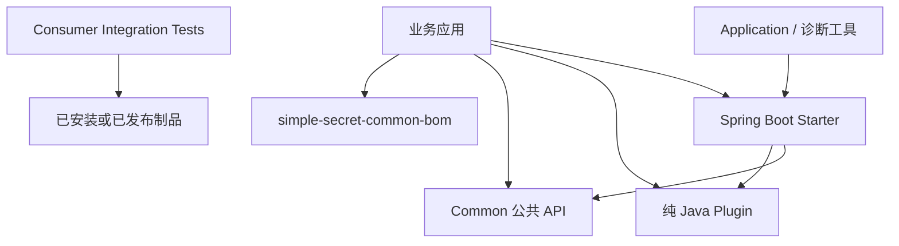

# Simple Secret

Simple Secret 是一个面向 Java 17 和 Spring Boot 3.5 的多模块组件库，提供可按需引入的公共 API、纯 Java
插件、Spring Boot starter 和本地诊断应用。

项目不是一套完整的业务开发框架。它只维护本目录中明确列出的能力，并遵循最小依赖原则：业务应用导入 BOM
统一版本后，只声明实际需要的模块，不依赖 common、plugins、starter 或 application 的聚合 POM。

## 项目基本信息

| 项目 | 当前配置 |
| --- | --- |
| Java | 17，根 POM 通过 Maven Enforcer 强制要求 `[17,18)` |
| Spring Boot | 3.5.16 |
| Maven 坐标 | `com.ss:*` |
| 当前版本 | `1.1.0` |
| 构建方式 | Maven 多模块 reactor |
| 模块类型 | Common、纯 Java Plugin、Spring Boot Starter、Application、Consumer Integration Test |
| 配置前缀 | Spring Boot 模块统一使用 `simple-secret.*` |

项目的主要设计原则：

- 按需引入：聚合 POM 只组织模块，不作为业务运行时依赖。
- 依赖单向：application -> starter/plugin/common，starter -> plugin/common，plugin -> common/JDK。
- 默认安全：会联网、监听端口、启动线程或加载原生库的 starter 默认关闭。
- 生命周期明确：网络、文件、线程、进程和 JNA/native 资源必须显式或由 Spring 容器管理。
- 消费者验证：`integration-tests` 脱离根 reactor，从已安装制品验证公开 API 和传递依赖。

## 整体架构



## 功能模块目录

### Common 公共模块

[Common 聚合说明](simple-secret-common/README.md)

| 模块 | 功能 | 文档 |
| --- | --- | --- |
| `simple-secret-common-bom` | 统一管理 Simple Secret 模块和关键第三方依赖版本 | [查看文档](simple-secret-common/simple-secret-common-bom/README.md) |
| `simple-secret-common-core` | Result、业务异常、HTTP 状态码和校验分组 | [查看文档](simple-secret-common/simple-secret-common-core/README.md) |
| `simple-secret-common-toolbox` | Lambda 属性、URI、缓存、动态列和时间工具 | [查看文档](simple-secret-common/simple-secret-common-toolbox/README.md) |
| `simple-secret-common-dict` | 字典注册、枚举查询、TTL 缓存和对象字段翻译 | [查看文档](simple-secret-common/simple-secret-common-dict/README.md) |

### 纯 Java Plugins

[Plugins 聚合说明](simple-secret-plugins/README.md)

| 模块 | 功能 | 文档 |
| --- | --- | --- |
| `simple-secret-plugin-geo` | 图片像素、WGS84 地理坐标和 DJI 相机遥测转换 | [查看文档](simple-secret-plugins/simple-secret-plugin-geo/README.md) |
| `simple-secret-plugin-kmz` | KML、KMZ、DJI WPML 航点任务读写 | [查看文档](simple-secret-plugins/simple-secret-plugin-kmz/README.md) |
| `simple-secret-plugin-udp` | JDK-only 的 UDP 单播与组播监听 | [查看文档](simple-secret-plugins/simple-secret-plugin-udp/README.md) |
| `simple-secret-plugin-excel` | 多 Sheet 导出、有界导入、错误工作簿、合并和树形导出 | [查看文档](simple-secret-plugins/simple-secret-plugin-excel/README.md) |
| `simple-secret-plugin-camera-sdk` | 摄像机厂商 SDK 领域模型、能力 SPI 和实例注册表 | [查看文档](simple-secret-plugins/simple-secret-plugin-camera-sdk/README.md) |
| `simple-secret-plugin-camera-sdk-hikvision` | 海康 HCNetSDK 登录、PTZ、预览和历史回放 JNA 驱动 | [查看文档](simple-secret-plugins/simple-secret-plugin-camera-sdk-hikvision/README.md) |
| `simple-secret-plugin-camera-sdk-dahua` | 大华 NetSDK 登录、PTZ、H.264 预览和热成像 JNA 驱动 | [查看文档](simple-secret-plugins/simple-secret-plugin-camera-sdk-dahua/README.md) |

### Spring Boot Starters

[Spring Boot Starters 聚合说明](simple-secret-springboot-starter/README.md)

| 模块 | 功能 | 文档 |
| --- | --- | --- |
| `simple-secret-springboot-starter-mqttv3` | MQTT 3.1.1 多客户端、发布订阅、请求响应和配置刷新 | [查看文档](simple-secret-springboot-starter/simple-secret-springboot-starter-mqttv3/README.md) |
| `simple-secret-springboot-starter-mqttv5` | MQTT v5 多客户端、共享订阅、请求响应和配置刷新 | [查看文档](simple-secret-springboot-starter/simple-secret-springboot-starter-mqttv5/README.md) |
| `simple-secret-springboot-starter-camera` | 海康、大华摄像机与 NVR 的 RTSP 地址组装 | [查看文档](simple-secret-springboot-starter/simple-secret-springboot-starter-camera/README.md) |
| `simple-secret-springboot-starter-hikvision` | 海康 HCNetSDK 自动配置和 Spring 生命周期管理 | [查看文档](simple-secret-springboot-starter/simple-secret-springboot-starter-hikvision/README.md) |
| `simple-secret-springboot-starter-dahua` | 大华 NetSDK 自动配置和 Spring 生命周期管理 | [查看文档](simple-secret-springboot-starter/simple-secret-springboot-starter-dahua/README.md) |
| `simple-secret-springboot-starter-nats` | NATS 多客户端、发布、请求响应和 queue group 订阅 | [查看文档](simple-secret-springboot-starter/simple-secret-springboot-starter-nats/README.md) |
| `simple-secret-springboot-starter-influxdb` | InfluxDB 1.x 映射、安全 InfluxQL、查询、写入和初始化 | [查看文档](simple-secret-springboot-starter/simple-secret-springboot-starter-influxdb/README.md) |
| `simple-secret-springboot-starter-netty-websocket` | 独立端口的原生 Netty WebSocket 服务 | [查看文档](simple-secret-springboot-starter/simple-secret-springboot-starter-netty-websocket/README.md) |
| `simple-secret-springboot-starter-zlm4j` | JVM 内嵌 ZLMediaKit、代理、录像、RTP、截图和转码 | [查看文档](simple-secret-springboot-starter/simple-secret-springboot-starter-zlm4j/README.md) |
| `simple-secret-springboot-starter-easymedia` | 基于 ZLM 的 WHIP/WHEP WebRTC 网关和媒体管理能力 | [查看文档](simple-secret-springboot-starter/simple-secret-springboot-starter-easymedia/README.md) |
| `simple-secret-springboot-starter-camera-zlm` | 大华 H.264 Annex-B 到 EasyMedia/ZLM 的适配层 | [查看文档](simple-secret-springboot-starter/simple-secret-springboot-starter-camera-zlm/README.md) |
| `simple-secret-springboot-starter-dji` | DJI H.264/H.265 SEI 解析、事件、SSE 诊断和 WebRTC 接入 | [查看文档](simple-secret-springboot-starter/simple-secret-springboot-starter-dji/README.md) |

### Applications

[Applications 聚合说明](simple-secret-application/README.md)

这些模块是可运行的本地开发或诊断工具，不作为业务依赖发布。

| 模块 | 功能 | 文档 |
| --- | --- | --- |
| `simple-secret-application-easymedia-test` | 验证内嵌 ZLM、EasyMedia、WHIP/WHEP、管理 API 和 SSE | [查看文档](simple-secret-application/simple-secret-application-easymedia-test/README.md) |
| `simple-secret-application-dji-sei-test` | 接收 RTMP H.264/H.265 视频并诊断 DJI SEI 数据 | [查看文档](simple-secret-application/simple-secret-application-dji-sei-test/README.md) |
| `simple-secret-application-pushstream` | 扫描受控媒体目录并管理 FFmpeg 循环推流进程 | [查看文档](simple-secret-application/simple-secret-application-pushstream/README.md) |

### Consumer Integration Tests

[Consumer Integration Tests 总体说明](integration-tests/README.md)

`integration-tests` 不加入根 reactor。每个 consumer 只依赖已安装或已发布的制品，用于验证第三方应用真正可见的
公开类、传递依赖、自动配置资源和最小启动行为。

| Consumer | 验证对象 | 文档 |
| --- | --- | --- |
| `consumer-toolbox` | Common Toolbox | [查看文档](integration-tests/consumer-toolbox/README.md) |
| `consumer-dict` | Common Dict | [查看文档](integration-tests/consumer-dict/README.md) |
| `consumer-udp` | UDP Plugin | [查看文档](integration-tests/consumer-udp/README.md) |
| `consumer-excel` | Excel Plugin | [查看文档](integration-tests/consumer-excel/README.md) |
| `consumer-camera-sdk` | Camera SDK API Plugin | [查看文档](integration-tests/consumer-camera-sdk/README.md) |
| `consumer-camera-sdk-hikvision` | Hikvision Camera SDK Plugin | [查看文档](integration-tests/consumer-camera-sdk-hikvision/README.md) |
| `consumer-camera-sdk-dahua` | Dahua Camera SDK Plugin | [查看文档](integration-tests/consumer-camera-sdk-dahua/README.md) |
| `consumer-mqttv3` | MQTT v3 Starter | [查看文档](integration-tests/consumer-mqttv3/README.md) |
| `consumer-mqttv5` | MQTT v5 Starter | [查看文档](integration-tests/consumer-mqttv5/README.md) |
| `consumer-camera` | Camera Starter | [查看文档](integration-tests/consumer-camera/README.md) |
| `consumer-nats` | NATS Starter | [查看文档](integration-tests/consumer-nats/README.md) |
| `consumer-influxdb` | InfluxDB Starter | [查看文档](integration-tests/consumer-influxdb/README.md) |
| `consumer-netty-websocket` | Netty WebSocket Starter | [查看文档](integration-tests/consumer-netty-websocket/README.md) |
| `consumer-zlm4j` | ZLM4J Starter | [查看文档](integration-tests/consumer-zlm4j/README.md) |
| `consumer-easymedia` | EasyMedia Starter | [查看文档](integration-tests/consumer-easymedia/README.md) |

## Maven 接入

项目制品发布在自定义 Maven 仓库。推荐先导入 BOM，再声明具体功能模块：

```xml
<repositories>
    <repository>
        <id>junpzx-custom-nexus</id>
        <url>https://repository.junpzx.cn/repository/maven-group/</url>
    </repository>
</repositories>

<dependencyManagement>
    <dependencies>
        <dependency>
            <groupId>com.ss</groupId>
            <artifactId>simple-secret-common-bom</artifactId>
            <version>1.1.0</version>
            <type>pom</type>
            <scope>import</scope>
        </dependency>
    </dependencies>
</dependencyManagement>

<dependencies>
    <dependency>
        <groupId>com.ss</groupId>
        <artifactId>simple-secret-springboot-starter-mqttv5</artifactId>
    </dependency>
</dependencies>
```

如果同时导入 Simple Secret BOM 和 Spring Boot BOM，应将 Simple Secret BOM 放在前面，使项目锁定的 Jackson、
Netty、POI、Commons 等版本约束优先生效。各模块的配置、代码示例、依赖边界和运行前提请查看上方对应文档。

## 构建验证

仓库没有 Maven Wrapper，使用系统 Maven。当前开发机默认 JDK 不是 17，执行前需显式选择 JDK 17：

```bash
export JAVA_HOME=/opt/homebrew/opt/openjdk@17

# 根 reactor：编译并运行单元测试
mvn clean verify

# 只验证一个模块及其依赖
mvn -pl simple-secret-springboot-starter/simple-secret-springboot-starter-mqttv5 -am test

# 第三方消费者兼容性验证
mvn install -DskipTests
mvn -f integration-tests/pom.xml test
```

海康、大华和 ZLMediaKit 等模块需要部署环境自行提供匹配操作系统及 CPU 架构的原生库。仓库不包含、下载或
自动解压厂商 SDK；具体平台限制和启动方式以对应模块 README 为准。
