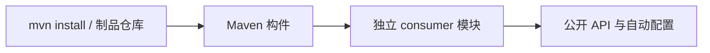

# Simple Secret Consumer Integration Tests

`integration-tests` 从第三方开发者视角验证已安装或已发布的 Simple Secret 构件。它不加入根 reactor，避免
测试误用同一 reactor 中尚未发布的类和依赖信息。

## 验证架构



每个 `consumer-*` 模块只声明第三方应用实际需要的依赖，并验证公开类、传递依赖、自动配置资源或最小启动
行为。测试不得依赖源码目录、测试夹具或根 reactor 的编译输出。

## 执行流程

```bash
JAVA_HOME=/opt/homebrew/opt/openjdk@17 mvn install -DskipTests
JAVA_HOME=/opt/homebrew/opt/openjdk@17 mvn -f integration-tests/pom.xml test
```

第一条命令把最新构件安装到本地 Maven 仓库，第二条命令让 15 个独立 consumer 解析并测试这些构件。

## Consumer 对应关系

- common：`consumer-toolbox`、`consumer-dict`
- plugin：`consumer-udp`、`consumer-excel`、`consumer-camera-sdk` 及两个厂商 SDK consumer
- starter：`consumer-mqttv3`、`consumer-mqttv5`、`consumer-camera`、`consumer-nats`、
  `consumer-influxdb`、`consumer-zlm4j`、`consumer-easymedia`、`consumer-netty-websocket`

这些模块只用于兼容性验证，不发布为业务构件。
