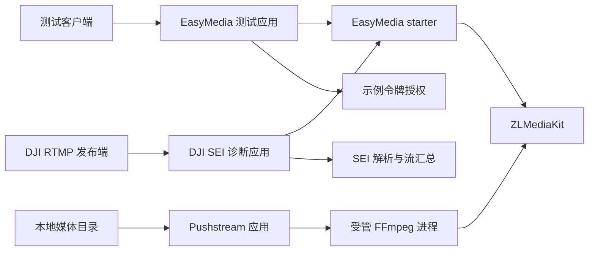

# Simple Secret Applications

`simple-secret-application` 是可运行示例、开发工具和契约验证应用的聚合模块，不是发布给业务系统使用的依赖。

## 当前应用

- `simple-secret-application-easymedia-test`：演示 EasyMedia 的安全配置、WHIP/WHEP、媒体管理 API 和事件监听。
- `simple-secret-application-dji-sei-test`：接收 RTMP H.264/H.265 视频并输出有界 SEI 诊断与流汇总。
- `simple-secret-application-pushstream`：扫描本地媒体目录，通过受管 FFmpeg 进程循环推送到内嵌 ZLMediaKit。

## 架构与流程



测试应用只提供本地开发示例。示例令牌、默认端口和本地配置不能直接用于生产部署，生产环境必须接入宿主
认证授权、TLS、受控网络入口和外部密钥管理。

Pushstream 是独立可运行应用。它默认关闭扫描和状态接口，不会因为 application 聚合模块存在而启动进程。
启用时必须提供本地 FFmpeg，并同时启用 zlm4j；详细配置、安全边界和故障恢复行为见
[Pushstream README](simple-secret-application-pushstream/README.md)。

DJI SEI 诊断应用默认关闭所有原生媒体能力，`local` profile 才在 `0.0.0.0:7935` 启用唯一的原生 RTMP
listener 和匿名 RTMP 发布，不启动 HTTP、RTSP 或 RTC listener，并保持匿名播放、WebRTC 和管理 API 关闭。
构建、`mk_api` 链接器前置条件、环境变量、结果判读与真实 DJI 验证边界见
[DJI RTMP SEI 诊断应用 README](simple-secret-application-dji-sei-test/README.md)。

## 构建

```bash
JAVA_HOME=/opt/homebrew/opt/openjdk@17 mvn -pl \
  simple-secret-application/simple-secret-application-easymedia-test,\
simple-secret-application/simple-secret-application-dji-sei-test -am verify
```

启动与接口调用案例见 [EasyMedia 测试应用 README](simple-secret-application-easymedia-test/README.md)。
