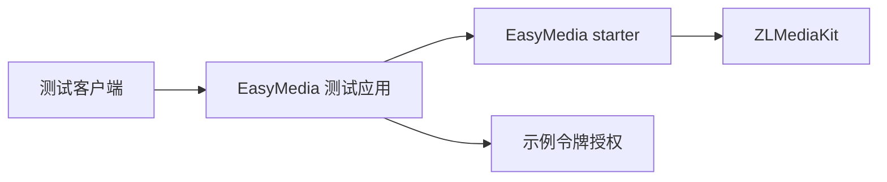

# Simple Secret Applications

`simple-secret-application` 是可运行示例和契约验证应用的聚合模块，不是发布给业务系统使用的依赖。

## 当前应用

- `simple-secret-application-easymedia-test`：演示 EasyMedia 的安全配置、WHIP/WHEP、媒体管理 API 和事件监听。

## 架构与流程



测试应用只提供本地开发示例。示例令牌、默认端口和本地配置不能直接用于生产部署，生产环境必须接入宿主
认证授权、TLS、受控网络入口和外部密钥管理。

## 构建

```bash
JAVA_HOME=/opt/homebrew/opt/openjdk@17 mvn -pl \
  simple-secret-application/simple-secret-application-easymedia-test -am verify
```

启动与接口调用案例见 [EasyMedia 测试应用 README](simple-secret-application-easymedia-test/README.md)。
