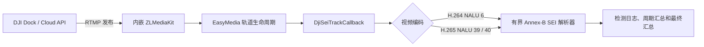

# DJI RTMP SEI 诊断应用

`simple-secret-application-dji-sei-test` 是独立可执行的 Spring Boot 诊断程序，用于判断 RTMP 的 H.264/H.265
视频帧中是否包含标准 SEI 消息。程序不提供 MQTT、数据库、REST 管理接口或业务数据持久化。

## 架构与流程



`local` profile 启用 zlm4j、EasyMedia 和诊断回调。媒体源注册后，EasyMedia 将 RTMP 视频轨道帧交给
`DjiSeiTrackCallback`；回调仅处理允许的 app 和 H.264/H.265 视频帧，解析三字节或四字节 Annex-B 起始码、
emulation-prevention 字节、变长 `payloadType` 与 `payloadSize`。日志预览、帧和 payload 都有显式上限。
畸形输入只写入当前流统计，不中断原生媒体回调线程。

默认 profile 关闭 zlm4j、EasyMedia、EasyMedia 管理 API 和 DJI SEI 回调，因此普通启动和自动化测试不会加载
`mk_api`。`local` profile 监听 `0.0.0.0:7935`，允许匿名发布、拒绝匿名播放，并关闭 WebRTC 和管理 API；
该配置只适合受控诊断网络，不能直接暴露到公网。

## 前置条件

- Java 17 和 Maven。
- 与操作系统、CPU 架构及当前 zlm4j JNA 接口兼容的 ZLMediaKit `mk_api` 动态库。
- `jna.library.path` 指向包含 `mk_api` 的目录。
- `mk_api` 的传递依赖可被平台链接器解析：macOS 使用 `DYLD_LIBRARY_PATH`，Linux 使用
  `LD_LIBRARY_PATH`，Windows 使用 `PATH`；也可以使用正确的 rpath 或系统安装目录。
- 能向诊断主机发布 RTMP 的 DJI Dock、DJI Cloud API 流或其他受控 H.264/H.265 测试源。

## 构建与启动

构建并生成可执行 JAR：

```bash
JAVA_HOME=/opt/homebrew/opt/openjdk@17 mvn -pl \
  simple-secret-application/simple-secret-application-dji-sei-test -am package
```

macOS 启动示例：

```bash
JAVA_HOME=/opt/homebrew/opt/openjdk@17 \
DYLD_LIBRARY_PATH=/path/to/zlmediakit/lib \
java -Djna.library.path=/path/to/zlmediakit/lib \
  -jar simple-secret-application/simple-secret-application-dji-sei-test/target/\
simple-secret-application-dji-sei-test.jar \
  --spring.profiles.active=local
```

Linux 将 `DYLD_LIBRARY_PATH` 改为 `LD_LIBRARY_PATH`。DJI 推流地址为：

```text
rtmp://<application-host>:7935/live/<streamId>
```

例如 `rtmp://192.0.2.10:7935/live/dock-01`。若修改允许的 app 或 RTMP 端口，推流地址必须同步调整。

## 配置

| 环境变量 | 默认值 | 用途与约束 |
| --- | --- | --- |
| `SIMPLE_SECRET_DJI_SEI_APP` | `live` | 允许诊断的 RTMP app，最长 64 个字符且不能为空 |
| `SIMPLE_SECRET_DJI_SEI_MAX_FRAME_BYTES` | `8388608` | 单帧上限，范围 1 字节至 64 MiB |
| `SIMPLE_SECRET_DJI_SEI_MAX_PAYLOAD_BYTES` | `1048576` | 单条 payload 上限，不得超过单帧上限，最大 64 MiB |
| `SIMPLE_SECRET_DJI_SEI_PREVIEW_BYTES` | `64` | 单条 payload 日志预览上限，范围 1 至 4096 字节 |
| `SIMPLE_SECRET_DJI_SEI_SUMMARY_INTERVAL` | `30s` | 周期汇总间隔，范围 1 秒至 1 小时 |
| `SIMPLE_SECRET_DJI_SEI_RTMP_PORT` | `7935` | `local` profile 的 RTMP 监听端口 |
| `SIMPLE_SECRET_DJI_SEI_ROOT` | `./runtime/dji-sei` | `local` profile 的 ZLMediaKit 根目录，日志写入其 `logs` 子目录 |

环境变量只改变有界诊断参数和本地媒体入口。EasyMedia 管理 API、WebRTC、匿名播放均保持关闭。

## 结果判读

检测到标准 SEI 时会出现类似日志：

```text
DJI RTMP SEI detected: app=live, stream=dock-01, codec=H264, pts=12, dts=10,
payloadType=5, payloadBytes=19, uuid=00010203-0405-0607-0809-0a0b0c0d0e0f, ...
```

已收到视频但未发现支持的 SEI 时，周期或最终汇总中的 `videoFrames` 为正且 `seiMessages=0`：

```text
DJI RTMP periodic summary: app=live, stream=dock-01, videoFrames=900, seiNalUnits=0,
seiMessages=0, malformedMessages=0, elapsedMs=30000
```

发现 SEI-like 数据但边界或语法无效时会先记录 WARN，汇总中的 `malformedMessages` 为正：

```text
DJI RTMP malformed SEI frame: app=live, stream=dock-01, codec=H264, issueCount=1,
firstIssueCode=TRUNCATED_PAYLOAD, ...
```

停止推流会触发媒体源注销，并输出 `DJI RTMP stream summary` 最终汇总。建议先停止 DJI 推流、确认最终汇总，
再通过 `Ctrl+C` 关闭应用；Spring 随后关闭内嵌 ZLMediaKit。若直接终止进程，是否收到媒体注销回调取决于原生库的
关闭事件时序，因此不应把缺少最终汇总解释为“流中没有 SEI”。

## 验证边界

自动化测试只证明 H.264/H.265 解析、资源上限、Spring 配置绑定和回调装配，不证明真实 DJI 码流携带 SEI。
本仓库验证时没有可用的 DJI 流或原生 `mk_api`，因此未执行真实推流测试。

Cloud API 的遥测、姿态、云台或定位字段不会从 RTMP 中推断。只有在 DJI 独立公开并确认相应 SEI payload
schema 后，才能对 payload 做这些业务字段的解释；没有解析到 SEI 也不能用于判断 Cloud API 遥测是否存在。
