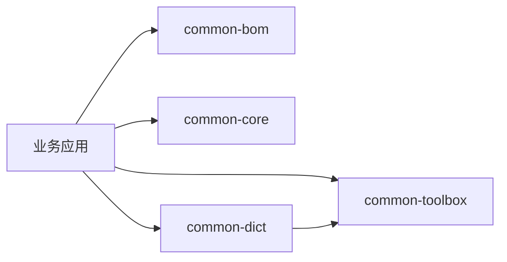

# Simple Secret Common

`simple-secret-common` 是公共模块聚合 POM，不应作为业务运行时依赖直接引入。应用应导入 BOM，并只声明
实际使用的 common 子模块。

## 模块结构

- `simple-secret-common-bom`：统一管理保留模块与关键第三方库版本。
- `simple-secret-common-core`：零第三方依赖的响应、异常、HTTP 状态码和校验分组。
- `simple-secret-common-toolbox`：零第三方运行时依赖的缓存、动态列、时间、Lambda 属性和 URI 工具。
- `simple-secret-common-dict`：只依赖 toolbox 的字典注册、查询、缓存和字段翻译。

## 依赖架构



`common-core` 与 `common-toolbox` 彼此独立。`common-dict` 只复用 toolbox，不依赖 Spring、数据库、Redis
或任何 starter。BOM 只参与 Maven 版本解析，不进入运行时 classpath。

## 使用流程

1. 在 `dependencyManagement` 中导入 `simple-secret-common-bom`。
2. 根据需要声明 `common-core`、`common-toolbox` 或 `common-dict`。
3. 业务代码直接使用公开 Java API，不需要组件扫描或自动配置。
4. 对包含生命周期的对象使用 `close()` 或 try-with-resources 释放资源。

## 验证

```bash
JAVA_HOME=/opt/homebrew/opt/openjdk@17 mvn -pl simple-secret-common -am verify
```

各子模块的完整案例见对应 README。
