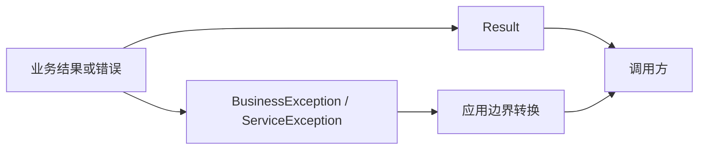

# Simple Secret Common Core

`simple-secret-common-core` 提供零第三方依赖的基础 API，不注册 Spring Bean，不创建线程，也不访问外部资源。

## Maven 依赖

```xml
<dependency>
    <groupId>com.ss</groupId>
    <artifactId>simple-secret-common-core</artifactId>
</dependency>
```

## 架构与流程



模块只表达通用状态和错误上下文。它不会自动捕获异常或生成 HTTP 响应，应用必须在 Controller、RPC 或消息
边界将异常转换为稳定的错误码和用户提示。

## 通用结果

```java
Result<OrderView> result = Result.ok("查询成功", orderView);
if (Result.isError(result)) {
    handleFailure(result.getCode(), result.getMessage());
}
```

`Result` 的 `code` 使用整数状态码，`message` 是可展示信息，`data` 是业务数据。空列表应由业务代码传入
空集合，不应使用 `null` 表示空列表。

## 业务异常

```java
throw BusinessException.normalForModule(
        "orders", "order {} not found", orderId);
```

需要国际化时使用稳定错误码：

```java
throw BusinessException.i18nForModule(
        "orders", "order.not-found", orderId);
```

`ServiceException` 适合表达服务执行失败，可携带数值错误码和仅供内部诊断的详情。边界层不得直接把
`detailMessage`、cause、文件路径或框架异常信息返回给外部调用方。

## HTTP 状态码与校验分组

`HttpStatusCodes` 提供常用整数状态码。`AddGroup`、`EditGroup`、`QueryGroup` 是 Jakarta Validation 的标记
接口，但本模块本身不依赖 Validation 实现，是否启用校验由宿主应用决定。

## 验证

```bash
JAVA_HOME=/opt/homebrew/opt/openjdk@17 mvn -pl \
  simple-secret-common/simple-secret-common-core verify
```
