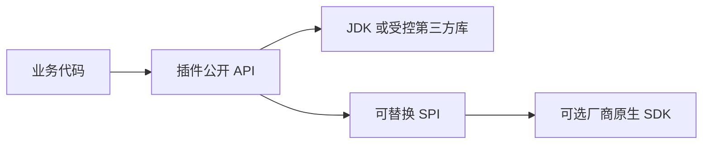

# Simple Secret Plugins

`simple-secret-plugins` 是纯 Java 插件聚合 POM。应用不应直接依赖该聚合模块，应按需声明具体插件。

## 模块选择

- `simple-secret-plugin-geo`：像素、地理坐标、DJI 照片和实时遥测投影。
- `simple-secret-plugin-kmz`：KML、KMZ、DJI WPML 航点任务读写。
- `simple-secret-plugin-udp`：UDP 单播和组播监听。
- `simple-secret-plugin-excel`：有界 Excel 导入、导出和错误工作簿。
- `simple-secret-plugin-camera-sdk`：摄像机 SDK 领域接口和服务注册表。
- `simple-secret-plugin-camera-sdk-hikvision`：海康 JNA 驱动。
- `simple-secret-plugin-camera-sdk-dahua`：大华 JNA 驱动。

## 架构与流程



插件不依赖 Spring 容器。带资源的插件通过显式 `start`、`stop`、`open`、`close` 管理生命周期；输入流和
输出流的所有权以各模块 README 为准。摄像机厂商插件只通过 Camera SDK API 模块暴露统一能力。

## 使用原则

1. 只声明实际使用的插件。
2. 外部输入先执行长度、数量、格式和路径边界校验。
3. 网络、文件和原生资源必须在 `finally` 或 try-with-resources 中释放。
4. 厂商 SDK 路径和设备凭据通过外部配置传入，不写入源码或仓库配置。

## 验证

```bash
JAVA_HOME=/opt/homebrew/opt/openjdk@17 mvn -pl simple-secret-plugins -am verify
```
