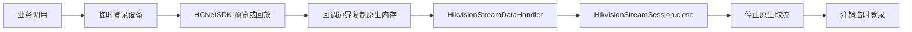

# Simple Secret Hikvision Camera SDK Plugin

`simple-secret-plugin-camera-sdk-hikvision` 是海康威视 HCNetSDK 的按需 JNA 驱动，提供显式登录/注销、同步或有界异步 PTZ、录像月历查询、实时预览、按时间历史回放和统一 SDK 生命周期。

模块只依赖 `simple-secret-plugin-camera-sdk` 与 JNA，不依赖 Spring、JSON、ZLM4J、FFmpeg、PlayCtrl、Hutool 或 Lombok，也不包含、下载或解压任何厂商 `.dll`、`.so`、`.dylib`。

## Maven 依赖

导入 Simple Secret BOM 后声明：

```xml
<dependency>
    <groupId>com.ss</groupId>
    <artifactId>simple-secret-plugin-camera-sdk-hikvision</artifactId>
</dependency>
```

未使用 BOM 时增加 `<version>1.1.0</version>`。JNA 由本驱动直接声明，应用不需要重复声明。

## 包结构与兼容边界

第三方应用只应依赖 `com.ss.ics.hikvision` 根包中的服务、配置、异常和返回类型。
`com.ss.ics.hikvision.internal` 及其 `model`、`query`、`jna` 子包是驱动内部实现，
不属于版本兼容承诺，即使个别类型因 Java 跨包调用而声明为 `public`，也不应由业务代码直接导入。

`HikvisionJnaStructures` 保留在根包是为了保持已有完整类名兼容，主要用于 JNA 结构映射；
常规接入应通过 `HikvisionCameraSdkService`，不要直接调用内部 native API、查询器或 JNA 加载器。

## 准备原生 SDK

部署环境必须自行取得与操作系统、CPU 架构和设备版本匹配的海康 HCNetSDK。驱动支持 Windows 和 Linux，不支持 macOS。

Windows 的配置目录中至少需要：

```text
HCNetSDK.dll
```

Linux 的配置目录中至少需要：

```text
libhcnetsdk.so
libcrypto.so.1.1
libssl.so.1.1
```

HCNetSDK 所需的组件目录及其他厂商依赖也应按海康发布包原有布局放置。模块不会把原生库路径写入异常，也不会默认开启厂商文件日志。

## 打开与关闭

构造 `HikvisionSdkOptions` 不会加载原生库。只有调用 `HikvisionCameraSdkService.open` 才会校验路径、加载 JNA 接口并初始化 HCNetSDK：

```java
Path sdkDirectory = Path.of(System.getenv("HIKVISION_SDK_HOME"));

HikvisionSdkOptions options = HikvisionSdkOptions.defaults(sdkDirectory);
try (HikvisionCameraSdkService hikvision = HikvisionCameraSdkService.open(options)) {
    // 登录、PTZ、录像查询或取流
}
```

`close()` 幂等，先停止异步 PTZ 执行器和所有剩余取流会话，再注销仍由服务跟踪的登录，最后清理 HCNetSDK。HCNetSDK 是进程级运行时，同一进程同时只允许打开一个 `HikvisionCameraSdkService`；关闭后可重新打开。应用必须为每个成功打开的服务执行关闭。

可显式设置录像查询总超时和异步 PTZ 排队容量：

```java
HikvisionSdkOptions options = new HikvisionSdkOptions(
        sdkDirectory,
        Duration.ofSeconds(8),
        128);
```

`fileSearchTimeout` 最小为 5 秒。原生单次查询超时按 HCNetSDK 有效范围限制为 5 到 15 秒；查询会在每次同步 native 调用前后检查总 deadline，避免设备持续返回“正在查找”或无限结果。JNA 无法安全抢占已经进入的厂商同步调用，因此 native 调用自身卡死时仍可能超过 deadline；需要硬隔离时应把驱动放入独立进程并由上层终止该进程。

## 登录

```java
DeviceDomain device = new DeviceDomain()
        .setIp("192.0.2.10")
        .setPort("8000")
        .setUsername(System.getenv("CAMERA_USERNAME"))
        .setPassword(System.getenv("CAMERA_PASSWORD"))
        .setChannel("1");

LoggedDomain logged = hikvision.login(device.toLoginDomain());
try {
    // 使用登录结果
} finally {
    hikvision.logout(logged.getUserId());
}
```

服务只跟踪原生登录句柄，不缓存账号或密码。异常只包含操作类型和海康错误码。

## PTZ 控制

一次性开始或停止控制：

```java
PTZControlDomain begin = new PTZControlDomain()
        .setCommand(PtzControlCommandEnums.LEFT)
        .setSpeedLevel(7)
        .setIsBegin(true);

boolean accepted = hikvision.syncControl(device, begin);
```

按持续时间自动开始并停止：

```java
PTZControlDomain turn = new PTZControlDomain()
        .setCommand(PtzControlCommandEnums.RIGHT)
        .setSpeedLevel(5)
        .setDuration(Duration.ofMillis(500));

hikvision.syncControl(device, turn);
```

`asyncControl` 使用单线程有界队列，保持命令顺序；队列已满或服务正在关闭时返回 `false`。方法在返回 `true` 前完成登录和参数解析，队列中只保存原生句柄及 PTZ 参数，不保存设备账号、密码或 `DeviceDomain`。
已接受任务的执行或注销失败不会从后台线程抛出到标准错误输出，可通过
`lastAsyncPtzFailure()` 获取最近一次失败。该状态只保留最近一项，监控系统应在读取后按业务需要记录和告警。

逻辑通道 `1` 映射到设备登录结果中的起始通道，PTZ 速度等级 1 到 10 会限制到海康范围 1 到 7。

## 录像月历查询

```java
PlayDomain request = new PlayDomain().setTakeStreamParam(
        new PlayDomain.TakeStreamParam().setStreamType(0));

List<PlaybackTimePeriodDomain> august = hikvision.playbackRecordExistByMonth(
        device, request, 2026, 8);
```

结果固定包含当月每一天；无录像的日期返回空时间段。跨午夜录像会拆分到对应日期，查找句柄和临时登录在成功、超时和异常路径都会释放。单次查询最多接受 10,000 个录像片段，超过后失败关闭，避免异常设备耗尽堆内存。`streamType` 支持主码流 `0`、子码流 `1`、第三码流 `2` 和全部码流 `255`。

## 取流架构与数据边界

实时预览和历史回放共用同一套资源所有权模型：



`HikvisionStreamData.dataType()` 是 HCNetSDK 原始回调类型。数据块可能是系统头、PS 流或其他厂商定义数据，不承诺是已经解码的 H.264 帧。插件会在原生回调返回前复制 `Pointer` 数据，业务代码获得的字节数组不依赖 JNA 内存生命周期；每次读取 `data()` 还会返回防御性副本。

业务 handler 在 HCNetSDK 厂商回调线程中执行，必须快速返回。需要解析、存储或转推时，应把数据提交给应用自行管理的有界线程池，并明确容量、拒绝策略和关闭行为。handler 抛出的运行时异常会在原生边界被隔离，不会回传给 HCNetSDK；应用仍应自行记录和监控消费失败。

单个 native 回调数据块最大接受 16 MiB，空指针、非正长度和超限长度会被丢弃，避免异常 ABI 或损坏回调触发无界堆分配。所有 Java 异常和错误均在 JNA 回调边界隔离。厂商返回重复播放句柄时，该句柄会整体失效：停止 native 流并注销关联登录，原会话随后关闭保持幂等。启动或关闭期间发生 native 链接错误时，服务会继续清理能够释放的其他资源，并保留原始错误作为 cause 或 suppressed 异常。

## 实时预览

```java
DeviceDomain device = new DeviceDomain()
        .setIp("192.0.2.10")
        .setPort("8000")
        .setUsername(System.getenv("CAMERA_USERNAME"))
        .setPassword(System.getenv("CAMERA_PASSWORD"))
        .setChannel("1");

PlayDomain request = new PlayDomain().setTakeStreamParam(
        new PlayDomain.TakeStreamParam()
                .setStreamType(0)
                .setByProtoType("0"));

try (HikvisionCameraSdkService hikvision = HikvisionCameraSdkService.open(options);
        HikvisionStreamSession session = hikvision.realPlay(
                device, request, data -> consume(data.dataType(), data.data()))) {
    awaitApplicationShutdown();
}
```

`streamType` 使用 HCNetSDK 预览码流类型范围 `0` 到 `10`；`byProtoType` 为 `0` 时使用私有协议，为 `1` 时使用 RTSP。逻辑通道 `1` 会映射到登录结果中的起始通道。

## 按时间历史回放

```java
PlayDomain request = new PlayDomain()
        .setTakeStreamParam(new PlayDomain.TakeStreamParam().setStreamType(0))
        .setPlaybackParam(new PlayDomain.PlaybackParam()
                .setCode("playback-20260812-01")
                .setBeginTime(LocalDateTime.of(2026, 8, 12, 10, 0))
                .setEndTime(LocalDateTime.of(2026, 8, 12, 10, 30))
                .setMultiplier(1.0D));

try (HikvisionCameraSdkService hikvision = HikvisionCameraSdkService.open(options);
        HikvisionStreamSession session = hikvision.playback(
                device, request, data -> consume(data.dataType(), data.data()))) {
    awaitPlaybackCompletion();
}
```

回放时间按设备本地时间传给 HCNetSDK，结束时间必须晚于开始时间。当前版本只支持正常一倍速正向播放；`multiplier` 可以不设置或设置为 `1.0D`，其他倍率会在登录设备前被拒绝。回放 `streamType` 仅支持 `0`、`1`、`2`。

两个入口都返回 `HikvisionStreamSession`。调用方必须使用 try-with-resources 或在 `finally` 中关闭会话；关闭顺序固定为先停止原生取流，再注销该会话的临时登录。停止失败时会话不会被误标记为已关闭，调用方可以重试。即使调用方遗漏关闭，服务 `close()` 也会尝试关闭全部剩余会话；若停止或注销失败，服务会保留未释放资源且不会提前清理 HCNetSDK，再次调用 `close()` 可继续清理。

## 安全边界

- 不要把 `DeviceDomain`、完整 RTSP 地址、账号或密码写入日志和异常。
- 原生 SDK 崩溃属于进程级故障，建议在独立服务进程中隔离高风险设备接入。
- 不要从不可信输入选择原生库目录；部署配置应只允许受控绝对路径。
- 当前构件只交付 HCNetSDK 原始回调数据；解码、封装转换和 ZLM 推流适配应放在独立 opt-in 模块中。

## 测试

```bash
JAVA_HOME=/opt/homebrew/opt/openjdk@17 mvn \
  -pl simple-secret-plugins/simple-secret-plugin-camera-sdk-hikvision \
  -am clean verify
```

单元测试使用窄原生接口替身，不要求安装真实 HCNetSDK，也不会触发 `Native.load`。真实 HCNetSDK 仅支持 Windows 和 Linux；自动化测试未替代真实摄像机、厂商原生库和网络环境的集成验证。
