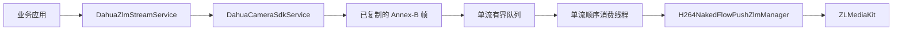

# Simple Secret Camera-to-ZLM Starter

`simple-secret-springboot-starter-camera-zlm` 是 Honeybee 摄像机 SDK 推流能力的最小依赖重构。它只组合
大华 NetSDK 输出的 H.264 Annex-B 数据与 EasyMedia 的 `H264NakedFlowPushZlmManager`，不会让纯 SDK
用户依赖 ZLM，也不会让普通 EasyMedia 用户依赖厂商 JNA。

## 依赖和支持范围

导入 Simple Secret BOM 后按需声明：

```xml
<dependency>
    <groupId>com.ss</groupId>
    <artifactId>simple-secret-springboot-starter-camera-zlm</artifactId>
</dependency>
```

该 starter 传递依赖大华 Camera SDK 插件和 EasyMedia。部署环境仍需提供大华 NetSDK、ZLMediaKit
`mk_api` 及其传递原生库；模块不携带或下载厂商二进制。

当前只支持大华实时 H.264 Annex-B。海康 `HikvisionStreamDataHandler` 返回的是 HCNetSDK 原始系统头、
PS 等数据，不能直接交给 H.264 publisher。海康转推需先使用成熟、可选的 PS 解复用或厂商 ES 回调能力，
本模块不会用不完整的自研解析器伪造支持。

## 架构和流程



启动流程为“校验 app/stream -> 原子预留流名 -> 启动单流 worker -> 登录设备并开启实时预览 ->
复制回调帧 -> 非阻塞写入有界队列 -> 顺序推送 ZLM”。相同 app/stream 同时只能存在一路会话。

关闭流程固定为“停止大华预览并注销临时登录 -> 中断并等待消费线程 -> 停止 ZLM publisher ->
移除活动会话”。启动失败会回滚流名和 publisher；队列溢出、worker 中断或 publisher 异常会自动清理，
并通过 `DahuaZlmStreamSession.failure()` 保留首个异常。原生库缺失或符号不匹配导致的
`LinkageError` 会在 SDK 启动、帧推送和资源停止边界转换为 `CameraZlmException`；停止失败的会话保留
注册状态，修复原生环境后可再次调用 `close()` 完成清理。

## Spring 配置

能力默认关闭：

```yaml
simple-secret:
  zlm4j:
    enabled: true
  camera-zlm:
    enabled: true
    queue-capacity: 150
    max-frame-bytes: 4194304
    max-buffered-bytes: 33554432
    close-timeout: 5s
```

队列按路分配，同时受帧数和字节数限制。Camera-ZLM 使用 EasyMedia 的同步背压入口，
每个片段完成解析后才释放上游预算；解析器为未完成 NALU 保留的累积数据也计入该路字节预算。
Annex-B 起始码可以跨 SDK 回调边界；同一回调内的多个 NALU 会分别推送。解析失败、ZLM native frame
创建失败或输入失败都会停止对应会话，并通过 `session.failure()` 暴露原始异常，不会继续接收并丢弃后续帧。
`queue-capacity` 范围是 1 到 10000，
`max-frame-bytes` 范围是 1 到 16 MiB，`max-buffered-bytes` 必须不小于单帧上限且最多 1 GiB。
达到任一边界都会停止该路会话，避免 ZLM 消费不足持续占用堆内存。

本 starter 不会根据配置文件中的路径自行加载大华 SDK。宿主必须使用受控配置创建
`DahuaCameraSdkService` Bean，凭据和原生库目录不得写入源码：

```java
@Bean(destroyMethod = "close")
DahuaCameraSdkService dahuaCameraSdkService() {
    DahuaSdkOptions options = DahuaSdkOptions.defaults(Path.of(
            System.getenv("DAHUA_NETSDK_DIRECTORY")));
    return DahuaCameraSdkService.open(options);
}
```

显式开启且容器中存在 `DahuaCameraSdkService` 后，starter 才创建名为
`cameraZlmH264Publisher` 的专用 publisher 和 `DahuaZlmStreamService`。普通宿主 publisher 不会被复用，
避免其他组件使用相同 `app/stream` 时混写码流或相互停止资源。宿主需要替换实现时，必须提供同名 Bean。

## 调用案例

```java
DeviceDomain device = new DeviceDomain()
        .setIp(System.getenv("CAMERA_HOST"))
        .setPort(System.getenv("CAMERA_PORT"))
        .setUsername(System.getenv("CAMERA_USERNAME"))
        .setPassword(System.getenv("CAMERA_PASSWORD"))
        .setChannel("1");

PlayDomain play = new PlayDomain().setTakeStreamParam(
        new PlayDomain.TakeStreamParam().setStreamType(0));

DahuaZlmStreamSession session = dahuaZlmStreamService.start(
        device, play, "live", "north-gate");

session.failure().ifPresent(failure -> alertStreamFailure("north-gate", failure));
session.close();
```

`app` 和 `stream` 只允许 1 到 128 个英文字母、数字、点、下划线或连字符，避免将外部输入直接带入
原生媒体资源名称。应用必须保存并关闭返回会话，Spring 关闭时服务会兜底清理全部活动会话。

## 安全和运维

- 禁止记录 `DeviceDomain`、账号、密码、完整摄像机地址或原始视频帧。
- native 崩溃是进程级故障；高风险设备应考虑独立进程隔离和外部健康检查。
- `failure()` 是会话级可观察状态，不替代 Micrometer、日志告警或业务重试编排。
- 自动重连未迁移。重连必须由业务层采用次数受限、退避和抖动策略，并确认同名流已完全关闭。
- 真实部署需要验证设备编码为 H.264；H.265 数据不会被自动转码。

## 验证

```bash
JAVA_HOME=/opt/homebrew/opt/openjdk@17 mvn \
  -pl simple-secret-springboot-starter/simple-secret-springboot-starter-camera-zlm \
  -am clean verify
```

单元测试不加载真实大华或 ZLM 原生库，覆盖顺序转推、重复流保护、队列溢出、启动回滚、异步失败、
原生链接错误和 Spring 默认关闭。真实 Windows/Linux、大华设备和 ZLMediaKit 的端到端联调需要在
部署环境执行。
